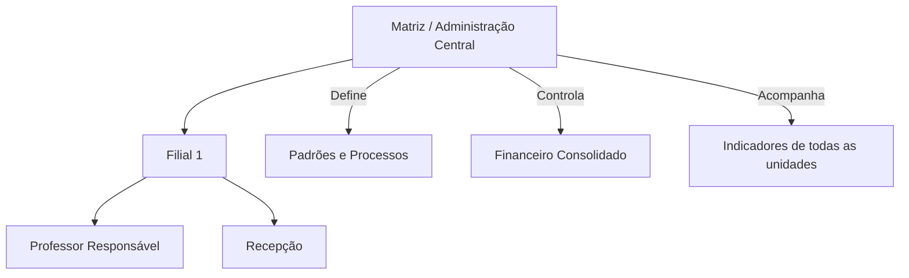
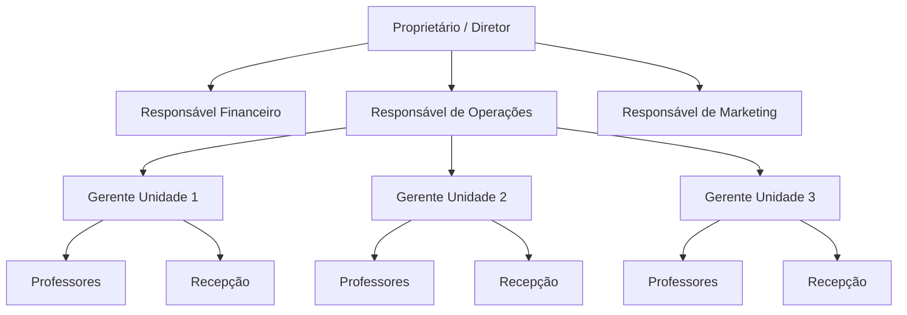
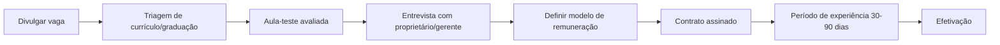
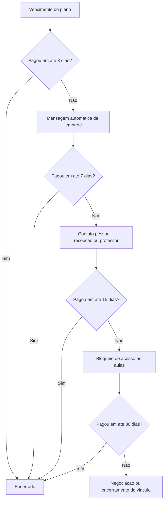
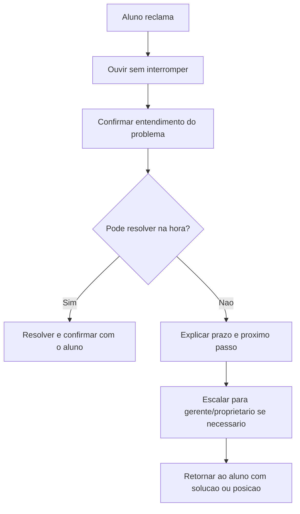
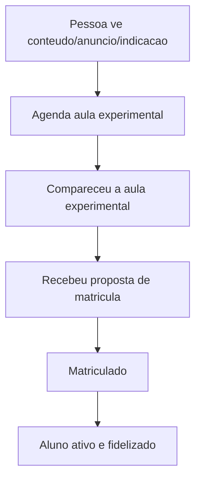
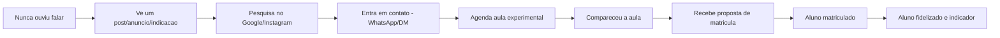
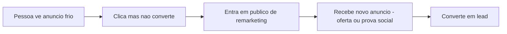
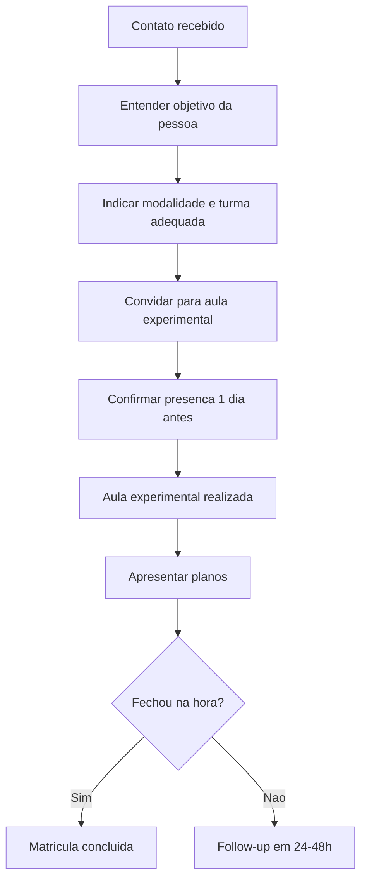

**Um guia prático para donos de academias de MMA, Boxe, Muay Thai e Jiu-Jitsu que administram múltiplas filiais**

---

## Como usar este manual

Este documento foi feito para ser consultado, não necessariamente lido do início ao fim. Cada capítulo é independente. Sempre que tiver uma dúvida específica — "como calculo minha margem de contribuição?", "como monto uma rotina semanal?" — vá direto ao capítulo correspondente pelo sumário abaixo.

Ao longo do texto você vai encontrar:

- **Tabelas** para comparar opções e organizar dados.
- **Checklists** prontos para aplicar no dia a dia.
- **Fluxogramas** (Mermaid) para entender processos visualmente.
- **Exemplos práticos** com números reais de uma academia fictícia (vamos chamá-la de "Academia Vitória", com 3 unidades).
- Avisos importantes marcados com ⚠️.

---

## Sumário

1. [Fundamentos da administração de academias](https://claude.ai/chat/b2e3a552-9cb0-4a0a-89c6-677e983360be#1-fundamentos-da-administra%C3%A7%C3%A3o-de-academias)
2. [Organizando uma empresa com várias unidades](https://claude.ai/chat/b2e3a552-9cb0-4a0a-89c6-677e983360be#2-organizando-uma-empresa-com-v%C3%A1rias-unidades)
3. [Estrutura organizacional e responsabilidades](https://claude.ai/chat/b2e3a552-9cb0-4a0a-89c6-677e983360be#3-estrutura-organizacional-e-responsabilidades)
4. [Gestão de professores, recepcionistas e colaboradores](https://claude.ai/chat/b2e3a552-9cb0-4a0a-89c6-677e983360be#4-gest%C3%A3o-de-professores-recepcionistas-e-colaboradores)
5. [Liderança e desenvolvimento de equipes](https://claude.ai/chat/b2e3a552-9cb0-4a0a-89c6-677e983360be#5-lideran%C3%A7a-e-desenvolvimento-de-equipes)
6. [Padronização de processos entre filiais](https://claude.ai/chat/b2e3a552-9cb0-4a0a-89c6-677e983360be#6-padroniza%C3%A7%C3%A3o-de-processos-entre-filiais)
7. [Indicadores (KPIs) para acompanhar](https://claude.ai/chat/b2e3a552-9cb0-4a0a-89c6-677e983360be#7-indicadores-kpis-para-acompanhar)
8. [Gestão financeira](https://claude.ai/chat/b2e3a552-9cb0-4a0a-89c6-677e983360be#8-gest%C3%A3o-financeira)
9. [Controle de inadimplência](https://claude.ai/chat/b2e3a552-9cb0-4a0a-89c6-677e983360be#9-controle-de-inadimpl%C3%AAncia)
10. [Gestão de alunos](https://claude.ai/chat/b2e3a552-9cb0-4a0a-89c6-677e983360be#10-gest%C3%A3o-de-alunos)
11. [Atendimento ao cliente](https://claude.ai/chat/b2e3a552-9cb0-4a0a-89c6-677e983360be#11-atendimento-ao-cliente)
12. [Marketing para academias](https://claude.ai/chat/b2e3a552-9cb0-4a0a-89c6-677e983360be#12-marketing-para-academias)
13. [Vendas de planos e produtos](https://claude.ai/chat/b2e3a552-9cb0-4a0a-89c6-677e983360be#13-vendas-de-planos-e-produtos)
14. [Gestão de estoque](https://claude.ai/chat/b2e3a552-9cb0-4a0a-89c6-677e983360be#14-gest%C3%A3o-de-estoque)
15. [Planejamento estratégico](https://claude.ai/chat/b2e3a552-9cb0-4a0a-89c6-677e983360be#15-planejamento-estrat%C3%A9gico)
16. [Metas e acompanhamento de resultados](https://claude.ai/chat/b2e3a552-9cb0-4a0a-89c6-677e983360be#16-metas-e-acompanhamento-de-resultados)
17. [Expansão para novas filiais](https://claude.ai/chat/b2e3a552-9cb0-4a0a-89c6-677e983360be#17-expans%C3%A3o-para-novas-filiais)
18. [Como delegar sem perder o controle](https://claude.ai/chat/b2e3a552-9cb0-4a0a-89c6-677e983360be#18-como-delegar-sem-perder-o-controle)
19. [Como criar processos documentados (POPs)](https://claude.ai/chat/b2e3a552-9cb0-4a0a-89c6-677e983360be#19-como-criar-processos-documentados-pops)
20. [Gestão de crises](https://claude.ai/chat/b2e3a552-9cb0-4a0a-89c6-677e983360be#20-gest%C3%A3o-de-crises)
21. [Gestão do tempo do proprietário](https://claude.ai/chat/b2e3a552-9cb0-4a0a-89c6-677e983360be#21-gest%C3%A3o-do-tempo-do-propriet%C3%A1rio)
22. [Ferramentas digitais recomendadas](https://claude.ai/chat/b2e3a552-9cb0-4a0a-89c6-677e983360be#22-ferramentas-digitais-recomendadas)
23. [Rotinas do gestor](https://claude.ai/chat/b2e3a552-9cb0-4a0a-89c6-677e983360be#23-rotinas-do-gestor)
24. [Principais erros e como evitá-los](https://claude.ai/chat/b2e3a552-9cb0-4a0a-89c6-677e983360be#24-principais-erros-e-como-evit%C3%A1-los)
25. [Estudos de caso](https://claude.ai/chat/b2e3a552-9cb0-4a0a-89c6-677e983360be#25-estudos-de-caso)
26. [Checklists consolidados](https://claude.ai/chat/b2e3a552-9cb0-4a0a-89c6-677e983360be#26-checklists-consolidados)
27. [Glossário](https://claude.ai/chat/b2e3a552-9cb0-4a0a-89c6-677e983360be#27-gloss%C3%A1rio)

---

## 1. Fundamentos da administração de academias

Administrar uma academia de artes marciais é, antes de tudo, administrar uma **empresa de serviços recorrentes**. Isso muda tudo: seu produto não é um kimono ou uma luva, é a **experiência de treino** que o aluno vive todo mês. Se essa experiência for boa, ele paga todo mês. Se for ruim, ele cancela.

### Os quatro pilares de uma academia saudável

|Pilar|Pergunta que ele responde|Exemplo prático|
|---|---|---|
|**Produto/Serviço**|O treino é bom?|Aulas no horário, professor preparado, ambiente limpo|
|**Pessoas**|Quem entrega esse serviço?|Professores, recepção, equipe de limpeza|
|**Processos**|Como as coisas são feitas?|Como um aluno se matricula, como se resolve um problema|
|**Dinheiro**|A empresa sobra ou falta?|Fluxo de caixa, inadimplência, precificação|

⚠️ O erro mais comum de donos de academia é dominar o pilar "Produto" (porque geralmente são ex-atletas ou professores) e ignorar completamente "Processos" e "Dinheiro". Este manual existe para equilibrar isso.

### Empresa X Hobby

Uma forma simples de saber se você está tratando sua academia como empresa:

- Você sabe, sem abrir planilha nenhuma, quanto sobrou de lucro no mês passado? Se não sabe, está no modo hobby.
- Se você ficar 30 dias fora do país, a academia continua funcionando igual? Se não, você é a academia, não o dono dela.
- Existe algum processo escrito (nem que seja num caderno) de como um aluno novo é recebido? Se não existe, cada unidade faz do seu jeito.

O objetivo deste manual é te tirar do "modo hobby" e colocar no "modo empresa", onde processos e números mandam mais do que o improviso do dia a dia.

---

## 2. Organizando uma empresa com várias unidades

Administrar uma unidade é diferente de administrar uma **rede**. Numa unidade só, você resolve tudo pessoalmente. Numa rede, você precisa de sistemas que funcionem sem você estar presente.

### Modelo Matriz + Filiais

A forma mais simples de organizar uma rede pequena/média (2 a 10 unidades) é pensar em duas camadas:



A **Matriz** (que pode ser só você e, no futuro, um gerente geral) cuida de:

- Financeiro consolidado (visão de todas as unidades juntas).
- Padrões de atendimento, preços, identidade visual.
- Marketing centralizado.
- Contratação e treinamento de novos professores.
- Decisões estratégicas (abrir filial, fechar filial, mudar preço).

Cada **Filial** cuida de:

- Execução do dia a dia (aulas, atendimento local, limpeza).
- Relacionamento direto com o aluno.
- Pequenas resoluções de problemas (sem precisar te ligar para tudo).

### Centralizado x Descentralizado: o que decidir onde

|Decisão|Onde deve ser tomada|Por quê|
|---|---|---|
|Preço dos planos|Matriz|Evita guerra de preço entre unidades e confusão de marca|
|Horário de aula extra pontual|Filial|Agilidade, não precisa de você|
|Contratação de professor novo|Matriz (com indicação da filial)|Padrão de qualidade|
|Compra de material de limpeza|Filial (com teto de valor)|Agilidade|
|Identidade visual e uniforme|Matriz|Consistência de marca|
|Liberar desconto pontual acima de X%|Matriz|Protege a margem|

⚠️ Regra prática: **tudo que afeta preço, marca ou padrão de qualidade é decisão de matriz. Tudo que é operação do dia a dia é decisão de filial**, dentro de um limite de autonomia que você define (por exemplo, gastos de até R$ 300 sem precisar te consultar).

### Passo a passo para organizar uma rede que já existe de forma bagunçada

1. Liste todas as unidades e quem é o responsável direto em cada uma.
2. Defina, por escrito, o que cada responsável de unidade pode decidir sozinho e o que precisa da sua aprovação.
3. Crie um grupo de comunicação único para assuntos operacionais (evite grupos soltos de WhatsApp sem regra).
4. Estabeleça uma reunião mensal com todos os responsáveis de unidade.
5. Unifique o sistema de gestão (cadastro de alunos, financeiro) em uma única ferramenta para todas as unidades — nunca cada unidade com sua própria planilha.

---

## 3. Estrutura organizacional e responsabilidades

### Organograma sugerido para uma rede de 3 a 5 unidades



Em redes menores, uma mesma pessoa pode acumular papéis (você mesmo pode ser Financeiro e Marketing no começo), mas é importante **separar as responsabilidades mesmo que não separe as pessoas ainda**. Isso facilita contratar depois.

### Matriz de responsabilidades (RACI simplificado)

RACI é uma ferramenta simples para saber quem faz o quê. As letras significam:

- **R**esponsável: quem executa.
- **A**provador: quem precisa aprovar antes de acontecer.
- **C**onsultado: quem deve ser ouvido antes.
- **I**nformado: quem só precisa saber depois.

|Atividade|Proprietário|Gerente de Unidade|Professor|Recepção|
|---|---|---|---|---|
|Definir preço dos planos|A|I|I|I|
|Contratar professor|A|C|-|-|
|Resolver reclamação simples de aluno|I|A|C|R|
|Fechar caixa do dia|I|A|-|R|
|Marcar presença em aula|I|I|R|I|
|Aprovar desconto acima do limite|A|C|-|-|
|Organizar evento de graduação|C|A|R|R|

### Descrição de cargo: por que isso importa

Cada função na academia deveria ter uma descrição simples de 5 a 10 linhas respondendo:

1. O que essa pessoa faz no dia a dia.
2. O que ela NÃO deve fazer (limites).
3. Para quem ela responde.
4. Como o trabalho dela é avaliado.

**Exemplo — Recepcionista:**

- Recebe alunos e visitantes, faz cadastro de novos alunos, cobra mensalidades em atraso até 5 dias, organiza materiais de venda (loja).
- Não decide desconto acima de 10% sem autorização do gerente.
- Responde ao Gerente da Unidade.
- Avaliada por: pontualidade, número de matrículas assistidas, zero erros de cadastro.

---

## 4. Gestão de professores, recepcionistas e colaboradores

Professores de artes marciais costumam ser ex-atletas ou atletas ativos — excelentes tecnicamente, mas nem sempre preparados para lidar com gestão de turma, retenção de aluno ou atendimento. Sua função como gestor é dar a eles ferramentas simples para isso.

### O que cobrar de um professor, além da técnica

|Área|O que observar|Como medir|
|---|---|---|
|Pontualidade|Chega e começa a aula no horário|Checklist diário de abertura|
|Retenção de turma|Alunos da turma dele cancelam menos que a média|Taxa de cancelamento por turma|
|Atendimento|Trata alunos novos e antigos com atenção|Pesquisa de satisfação trimestral|
|Padrão técnico|Segue o currículo/grade da modalidade|Avaliação técnica periódica|
|Disciplina de turma|Mantém ambiente seguro e respeitoso|Feedback dos alunos, observação direta|

### Modelo de remuneração de professores

Existem três modelos comuns. Cada um tem prós e contras:

|Modelo|Como funciona|Vantagem|Risco|
|---|---|---|---|
|Fixo por aula/hora|Paga um valor fixo por aula dada|Simples de calcular|Professor não tem incentivo de reter aluno|
|Fixo + comissão por retenção/matrícula|Fixo baixo + bônus por aluno mantido/matriculado|Cria incentivo alinhado com o negócio|Mais complexo de calcular e explicar|
|Percentual sobre faturamento da turma|Professor ganha % do que a turma dele fatura|Alinha 100% o interesse dele com o seu|Pode gerar disputa entre professores por alunos|

⚠️ Independente do modelo escolhido, deixe por escrito e assinado. Mudanças de remuneração sem contrato claro são a maior causa de conflitos com professores em academias.

### Processo de contratação de professor (passo a passo)



### Checklist — Onboarding de novo colaborador

- [ ] Contrato assinado e enviado para o financeiro
- [ ] Apresentado à equipe da unidade
- [ ] Recebeu o manual de padrões da academia (ver capítulo 6)
- [ ] Sabe usar o sistema de gestão (cadastro, presença, caixa)
- [ ] Sabe quais decisões pode tomar sozinho e quais precisa escalar
- [ ] Tem contato direto de quem chamar em caso de dúvida/emergência
- [ ] Data de avaliação de experiência agendada

---

## 5. Liderança e desenvolvimento de equipes

Liderar uma equipe de professores é diferente de liderar uma equipe administrativa. Professores costumam responder melhor a liderança pelo exemplo e por reconhecimento técnico do que a hierarquia pura.

### Estilos de liderança e quando usar cada um

|Estilo|Quando usar|Exemplo na academia|
|---|---|---|
|Diretivo|Situações de risco, segurança, crise|Corrigir imediatamente uma falha de segurança em treino|
|Coach (orientador)|Desenvolvimento de longo prazo|Ajudar um professor a melhorar retenção de turma|
|Participativo|Decisões de padrão/processo|Definir junto com professores o horário de novas turmas|
|Delegativo|Equipe madura e já treinada|Deixar o gerente de unidade decidir escala de horários|

### Reuniões 1:1 com responsáveis de unidade

Uma prática simples e poderosa: reunião individual mensal (15-30 minutos) com cada gerente/professor responsável de unidade. Pauta sugerida:

1. Como estão os números da unidade (frequência, matrículas, cancelamentos)?
2. Algum problema com equipe ou aluno que eu deveria saber?
3. O que está funcionando bem que podemos replicar em outras unidades?
4. O que essa pessoa precisa de você para trabalhar melhor?

### Desenvolvendo sucessores

Se você tem 3+ unidades, o maior risco de crescimento é depender só de você. Desenvolva ao menos um "braço direito" por unidade que possa tomar decisões operacionais na sua ausência. Sinais de que alguém está pronto para mais responsabilidade:

- Resolve problemas de aluno sem te acionar.
- Cumpre prazos e processos sem cobrança.
- Já treinou ou ajudou outro colaborador novo.
- Entende os números básicos da unidade (frequência, inadimplência).

---

## 6. Padronização de processos entre filiais

Padronizar não significa que todas as unidades são idênticas — significa que a **experiência do aluno e os processos-chave** são consistentes, não importa qual unidade ele frequente.

### O que deve ser 100% padronizado

- Identidade visual (logo, cores, uniformes).
- Tabela de preços e planos.
- Roteiro de recepção de aluno novo (o que se fala, o que se mostra).
- Processo de cobrança de inadimplência.
- Currículo técnico por modalidade e faixa/graduação.
- Política de cancelamento e trancamento.

### O que pode variar por unidade

- Horários de aula (conforme demanda local).
- Decoração pontual/eventos locais.
- Pequenas parcerias locais (ex: farmácia do bairro).

### Como criar um "Manual de Padrões da Rede"

Esse é o documento mestre que toda unidade nova recebe. Estrutura sugerida:

1. Identidade da marca (visual, tom de voz, valores).
2. Tabela de planos e preços vigentes.
3. Roteiro de atendimento (recepção, matrícula, resolução de reclamação).
4. Processo financeiro (abertura/fechamento de caixa, cobrança).
5. Currículo técnico de cada modalidade.
6. Regras de conduta e segurança dos treinos.

⚠️ Um manual de padrões só funciona se for **curto e visual**. Documentos de 80 páginas não são lidos por ninguém. Prefira 15-20 páginas com bastante checklist e exemplo.

---

## 7. Indicadores (KPIs) para acompanhar

Você não precisa acompanhar 50 indicadores. Precisa acompanhar **poucos, mas todo dia/semana/mês**, sem falhar.

### Indicadores diários

|Indicador|O que é|Meta de exemplo|
|---|---|---|
|Frequência de alunos|Quantos alunos treinaram hoje|Acompanhar tendência, não valor absoluto|
|Novos leads/visitantes|Quantas pessoas novas entraram em contato|2-3 por unidade/dia|
|Caixa do dia|Quanto entrou e saiu|Bater com o esperado|

### Indicadores semanais

|Indicador|O que é|Meta de exemplo|
|---|---|---|
|Matrículas da semana|Novos alunos matriculados|Definido por unidade|
|Cancelamentos da semana|Alunos que saíram|Menor que matrículas|
|Aulas experimentais agendadas|Visitantes agendados para testar|Acompanhar taxa de conversão|

### Indicadores mensais

|Indicador|O que é|Fórmula|
|---|---|---|
|Ticket médio|Quanto cada aluno paga em média|Faturamento ÷ número de alunos ativos|
|Taxa de cancelamento (churn)|% de alunos que saíram no mês|Cancelamentos ÷ base de alunos no início do mês|
|Taxa de inadimplência|% do faturamento esperado que não entrou|Valor em atraso ÷ faturamento esperado|
|CAC (Custo de Aquisição de Cliente)|Quanto custa trazer 1 aluno novo|Gasto total de marketing ÷ novos alunos|
|LTV (Valor do cliente ao longo do tempo)|Quanto um aluno gera durante todo o tempo que fica|Ticket médio × tempo médio de permanência (meses)|
|Margem de contribuição|Quanto sobra de cada real de receita depois dos custos variáveis|(Receita - Custos Variáveis) ÷ Receita|

### Painel simples sugerido (por unidade e consolidado)

|Unidade|Alunos ativos|Matrículas mês|Cancelamentos mês|Churn %|Inadimplência %|Faturamento|Lucro|
|---|---|---|---|---|---|---|---|
|Unidade 1||||||||
|Unidade 2||||||||
|Unidade 3||||||||
|**Consolidado**||||||||

⚠️ Regra de ouro: **se não está escrito numa planilha ou sistema, não está sendo gerenciado — está apenas sendo lembrado até você esquecer.**

---

## 8. Gestão financeira

Este é o capítulo mais importante para a saúde do negócio. A maioria das academias não fecha por falta de alunos — fecha por falta de controle financeiro.

### 8.1 Fluxo de caixa

Fluxo de caixa é simplesmente: **o que entra e o que sai de dinheiro, e quando**. Não confunda com lucro — você pode ter lucro no papel e não ter dinheiro em caixa por causa do momento em que as entradas e saídas acontecem.

**Modelo simples de fluxo de caixa mensal:**

|Item|Valor|
|---|---|
|(+) Recebimento de mensalidades|R$ 45.000|
|(+) Venda de produtos (loja)|R$ 3.000|
|(+) Aulas particulares/eventos|R$ 2.000|
|(=) **Total de entradas**|**R$ 50.000**|
|(-) Aluguel|R$ 8.000|
|(-) Folha de professores|R$ 15.000|
|(-) Folha administrativa|R$ 6.000|
|(-) Contas (água, luz, internet)|R$ 2.500|
|(-) Marketing|R$ 2.000|
|(-) Manutenção/limpeza|R$ 1.500|
|(=) **Total de saídas**|**R$ 35.000**|
|**(=) Saldo do mês**|**R$ 15.000**|

Faça isso **por unidade** e depois consolide. Isso mostra rapidamente qual unidade dá lucro e qual está no vermelho.

### 8.2 Controle de custos

Classifique seus custos em duas categorias:

- **Custos fixos**: existem independente de quantos alunos você tem (aluguel, folha fixa, internet).
- **Custos variáveis**: crescem conforme o número de alunos ou atividade (comissão de professor por aluno, material de consumo).

|Tipo|Exemplos na academia|
|---|---|
|Fixo|Aluguel, salário fixo administrativo, sistema de gestão, internet|
|Variável|Comissão sobre matrícula, material de treino consumido, taxas de cartão de crédito|

### 8.3 Precificação

Preço não deve ser "o que o concorrente cobra" — deve ser calculado a partir do seu custo e da margem que você precisa.

**Passo a passo simples de precificação:**

1. Calcule seu custo fixo total mensal (por unidade).
2. Divida pelo número mínimo de alunos que cobre esse custo (ponto de equilíbrio).
3. Defina a margem de lucro desejada (ex: 20-30%).
4. Compare com o mercado local — se seu preço calculado for muito acima, revise custos ou público-alvo; se estiver muito abaixo, você está deixando dinheiro na mesa.

**Exemplo:**

- Custo fixo mensal da unidade: R$ 20.000
- Ponto de equilíbrio com ticket médio de R$ 150: 134 alunos pagantes
- Se a unidade tem 200 alunos: sobra de margem para reinvestir ou lucrar

### 8.4 Lucro

Lucro = Receita Total - Todos os Custos (fixos + variáveis) - Impostos.

Existem dois conceitos úteis:

|Tipo de lucro|O que mostra|
|---|---|
|Lucro Bruto|Receita menos custos diretos do serviço|
|Lucro Líquido|O que sobra de fato depois de TODOS os custos e impostos|

⚠️ Nunca confunda "dinheiro que sobrou na conta este mês" com lucro real. Pode haver dinheiro parado que é, na verdade, reserva para o 13º salário dos professores ou impostos futuros.

### 8.5 Margem de contribuição

É quanto cada plano/aluno "contribui" para pagar os custos fixos depois de descontar os custos variáveis dele.

**Fórmula:**

```
Margem de Contribuição = Receita - Custos Variáveis
Margem de Contribuição (%) = (Receita - Custos Variáveis) / Receita
```

**Exemplo com um plano de R$ 150/mês:**

|Item|Valor|
|---|---|
|Receita do plano|R$ 150|
|Custo variável (comissão de professor, taxa de cartão)|R$ 30|
|**Margem de contribuição**|**R$ 120 (80%)**|

Isso te diz: cada aluno novo contribui com R$ 120 para pagar aluguel, folha fixa etc. Multiplique pelo número de alunos e compare com seus custos fixos totais — isso mostra seu ponto de equilíbrio.

### 8.6 Capital de giro

É o dinheiro necessário para manter a operação funcionando entre o momento em que você paga as contas e o momento em que recebe dos alunos. Academias têm um ciclo relativamente previsível (mensalidades), mas atrasos e inadimplência criam necessidade de capital de giro.

**Regra prática:** mantenha em caixa/conta o equivalente a pelo menos **1 a 2 meses de custo fixo total** como capital de giro, separado da reserva de emergência.

### 8.7 Reserva financeira

Diferente do capital de giro (para o dia a dia), a reserva financeira é para **imprevistos grandes**: uma unidade que precisa de reforma emergencial, queda brusca de alunos, um processo trabalhista.

|Tipo de reserva|Para quê|Quanto guardar (referência)|
|---|---|---|
|Capital de giro|Operação normal do dia a dia|1-2 meses de custo fixo|
|Reserva de emergência|Imprevistos grandes|3-6 meses de custo fixo total da rede|
|Reserva de expansão|Nova filial, reforma, equipamento novo|Definida por projeto|

### Checklist financeiro mensal

- [ ] Fluxo de caixa de cada unidade atualizado
- [ ] Fluxo de caixa consolidado da rede revisado
- [ ] Inadimplência do mês verificada e ações de cobrança iniciadas
- [ ] Custos fixos e variáveis revisados (algum aumento inesperado?)
- [ ] Margem de contribuição por plano recalculada se houve mudança de custo
- [ ] Reserva financeira e capital de giro conferidos
- [ ] Comparação do mês com o mês anterior e com o mesmo mês do ano passado

---

## 9. Controle de inadimplência

Inadimplência é, depois do cancelamento, a maior sangria silenciosa de uma academia. Alunos inadimplentes muitas vezes continuam treinando — o que mascara o problema.

### Processo recomendado de cobrança



### Boas práticas

- Automatize lembretes (a maioria dos sistemas de gestão de academia faz isso via SMS/WhatsApp).
- Nunca deixe o professor ser o cobrador direto — isso desgasta a relação de treino. O ideal é recepção/financeiro.
- Tenha uma política clara de quando bloquear acesso (geralmente entre 10-15 dias de atraso), aplicada igual para todos, sem exceção "porque é meu amigo".
- Ofereça, quando fizer sentido, negociação (parcelamento) antes de cancelar — reter um aluno negociando é mais barato que conseguir um novo.

### Meta de referência

|Indicador|Referência saudável|
|---|---|
|Inadimplência (% do faturamento esperado)|Abaixo de 5%|
|Tempo médio de atraso resolvido|Menos de 15 dias|

⚠️ Se sua inadimplência está acima de 10%, o problema geralmente não é "aluno mal pagador" — é falta de processo de cobrança claro e automatizado.

---

## 10. Gestão de alunos

### 10.1 Matrículas

O processo de matrícula é o primeiro contato "oficial" do aluno com a marca. Um roteiro padronizado evita que a experiência dependa do humor do recepcionista do dia.

**Roteiro sugerido de matrícula:**

1. Boas-vindas e breve tour pela unidade.
2. Entender o objetivo do aluno (saúde, competição, defesa pessoal, socialização).
3. Apresentar planos adequados ao objetivo (não empurrar sempre o mais caro).
4. Explicar política de cancelamento/trancamento com transparência.
5. Cadastro completo no sistema (dados, contato de emergência, atestado se exigido).
6. Apresentação ao professor da turma que ele vai frequentar.
7. Follow-up (contato) após a primeira semana para saber como foi.

### 10.2 Renovações

Renovação não deveria ser um evento — deveria ser automática (recorrência no cartão/débito) sempre que possível. Isso reduz drasticamente o cancelamento por "esquecimento".

### 10.3 Cancelamentos

Todo cancelamento é uma oportunidade de aprendizado. Tenha um processo simples:

1. Entender o motivo real (nem sempre é o motivo dito — "falta de tempo" pode esconder insatisfação com o professor, por exemplo).
2. Registrar o motivo em uma planilha/sistema (motivo padronizado: preço, horário, mudança de cidade, insatisfação, saúde, etc.).
3. Tentar uma proposta de retenção quando fizer sentido (trancamento temporário, mudança de turma).
4. Se o cancelamento seguir, perguntar se pode entrar em contato futuramente (reativação).

**Tabela de motivos de cancelamento (para preencher e acompanhar mensalmente):**

|Motivo|Quantidade no mês|% do total|
|---|---|---|
|Preço|||
|Horário incompatível|||
|Mudança de cidade|||
|Insatisfação com aula/professor|||
|Motivo de saúde|||
|Falta de tempo|||
|Outro|||

### 10.4 Retenção

Retenção é mais barata que aquisição. Práticas que aumentam retenção:

- Contato proativo quando o aluno falta 2+ semanas seguidas (não espere ele cancelar).
- Reconhecimento de marcos (graduação, aniversário, tempo de casa).
- Eventos sociais da academia (confraternizações, campeonatos internos).
- Professor conhece o aluno pelo nome e acompanha sua evolução.

### 10.5 Fidelização

Fidelização vai além de reter — é fazer o aluno se tornar promotor da marca.

**Ideias práticas:**

- Programa de indicação (desconto para quem indica e para quem é indicado).
- Graduações e faixas com cerimônia — cria senso de pertencimento.
- Grupo de alunos veteranos/mentores para novatos.

---

## 11. Atendimento ao cliente

Atendimento é o que o aluno sente em cada contato com a academia — recepção, professor, financeiro, redes sociais.

### Princípios de bom atendimento em academia

|Princípio|Na prática|
|---|---|
|Rapidez|Responder mensagens em até algumas horas, não dias|
|Clareza|Explicar planos, regras e cobranças sem letras miúdas|
|Consistência|O mesmo padrão de atendimento em qualquer unidade|
|Empatia|Reconhecer frustração do aluno antes de explicar a regra|

### Como tratar reclamações



⚠️ Nunca discuta com um aluno na frente de outros alunos. Leve a conversa difícil para um espaço reservado.

---

## 12. Marketing para academias

### Onde investir esforço de marketing

|Canal|Quando usar|Observação|
|---|---|---|
|Indicação (boca a boca)|Sempre|O canal mais barato e mais forte em artes marciais|
|Instagram/redes sociais|Sempre|Mostrar ambiente, alunos (com autorização), resultados|
|Anúncios pagos (Meta Ads)|Quando já tem processo de recepção rodando bem|De nada adianta trazer visitante se a recepção não converte|
|Parcerias locais|Bairro/região específica|Farmácias, escolas, empresas próximas|
|Eventos abertos (aula experimental gratuita)|Períodos de baixa captação|Bom gatilho de conversão|

### Funil simples de marketing para academia



**Acompanhe a taxa de conversão em cada etapa.** Se muita gente agenda mas não comparece, o problema é follow-up antes da aula. Se muita gente comparece mas não matricula, o problema é a experiência da aula-teste ou a apresentação de planos.

### O que evitar

- Descontos agressivos e recorrentes que desvalorizam a marca (o aluno passa a esperar sempre desconto).
- Postar conteúdo apenas de luta/competição — mostre também o dia a dia, iniciantes, resultados de saúde e disciplina, que atrai o público que paga mensalidade (nem sempre é o competidor).

---

## 13. Vendas de planos e produtos

### Tipos de planos comuns

|Plano|Característica|Quando oferecer|
|---|---|---|
|Mensal avulso|Sem fidelidade, preço cheio|Aluno testando o compromisso|
|Trimestral/Semestral/Anual|Desconto por fidelidade|Aluno já engajado, reduz churn|
|Modalidade única|Acesso a 1 modalidade|Público específico (só Jiu-Jitsu, por exemplo)|
|Passe livre (todas modalidades)|Acesso a MMA, Boxe, Muay Thai, Jiu-Jitsu|Ticket médio maior, fideliza mais|
|Plano família|Desconto para grupo familiar|Aumenta retenção (saída de um afeta o grupo)|

### Venda de produtos (kimonos, luvas, uniformes, suplementos)

- Trate como um centro de lucro à parte, não "favor" ao aluno.
- Tenha margem clara sobre o custo (normalmente 30-50% em vestuário/equipamento).
- Padronize kits de matrícula (ex: "kit iniciante Jiu-Jitsu" com kimono + faixa) para facilitar a decisão do aluno novo.

### Script básico de vendas (sem ser insistente)

1. Entenda a necessidade antes de falar de preço.
2. Apresente o plano que resolve a necessidade, não o mais caro por padrão.
3. Seja transparente sobre taxa de matrícula, fidelidade e cancelamento.
4. Se o aluno hesitar, pergunte o que especificamente o preocupa (preço, tempo, compromisso) antes de insistir.

---

## 14. Gestão de estoque

Itens típicos: kimonos, luvas, bandagens, uniformes, protetores bucais, suplementos, itens de limpeza.

### Controle simples de estoque

|Prática|Como aplicar|
|---|---|
|Estoque mínimo|Defina uma quantidade mínima por item; ao atingir, disparar pedido de reposição|
|Contagem periódica|Contagem física mensal comparada ao sistema|
|Fornecedor único vs múltiplo|Ter ao menos 2 fornecedores por categoria evita depender de um só|
|Produtos por validade (suplementos)|Controle de lote e validade, giro rápido (FIFO — primeiro que entra, primeiro que sai)|

**Tabela de controle (modelo):**

|Item|Estoque mínimo|Estoque atual|Fornecedor|Última compra|
|---|---|---|---|---|
|Kimono infantil|5||||
|Kimono adulto|5||||
|Luva de boxe (par)|10||||
|Bandagem|20||||
|Protetor bucal|15||||

⚠️ Nunca deixe o controle de estoque só na cabeça de um colaborador. Sistema ou planilha, sempre.

---

## 15. Planejamento estratégico

Planejamento estratégico não precisa ser complicado. Uma ferramenta simples e eficaz é a **Análise SWOT** (Forças, Fraquezas, Oportunidades, Ameaças), revisada a cada 6-12 meses.

|Ajuda|Atrapalha|
|---|---|---|
|**Interno**|Forças (ex: professores renomados, localização boa)|Fraquezas (ex: sistema de gestão fraco, alta rotatividade)|
|**Externo**|Oportunidades (ex: bairro crescendo, concorrente fechou)|Ameaças (ex: nova academia forte chegando, crise econômica local)|

### Passo a passo de planejamento anual simplificado

1. Revisar os números do ano (faturamento, churn, inadimplência, número de alunos por unidade).
2. Fazer a análise SWOT com sua equipe de liderança.
3. Definir de 3 a 5 objetivos prioritários para o próximo ano (não mais que isso).
4. Transformar cada objetivo em metas mensuráveis (ver capítulo 16).
5. Revisar trimestralmente o progresso.

---

## 16. Metas e acompanhamento de resultados

Use o modelo **SMART** para toda meta: **E**specífica, **M**ensurável, **A**tingível, **R**elevante, **T**emporal.

**Exemplo de meta mal formulada:** "Quero crescer a academia este ano."

**Exemplo de meta SMART:** "Aumentar o número de alunos ativos da Unidade 2 de 180 para 220 até dezembro, reduzindo o churn mensal de 6% para 4%."

### Modelo de acompanhamento trimestral

| Objetivo               | Meta               | Resultado Trimestre 1 | Resultado Trimestre 2 | Ação corretiva |
| ---------------------- | ------------------ | --------------------- | --------------------- | -------------- |
| Crescer base de alunos | +40 alunos até dez |                       |                       |                |
| Reduzir churn          | De 6% para 4%      |                       |                       |                |
| Reduzir inadimplência  | De 8% para 5%      |                       |                       |                |

---

## 17. Expansão para novas filiais

### Antes de abrir uma nova unidade, responda:

- [ ] A unidade atual mais antiga está no ponto de equilíbrio ou lucrativa há pelo menos 6 meses consecutivos?
- [ ] Existe processo documentado (POP) que permite replicar a operação sem sua presença diária?
- [ ] Você já tem um gerente/responsável de confiança para tocar a nova unidade?
- [ ] Fez pesquisa de concorrência e público-alvo na região da nova unidade?
- [ ] Tem reserva financeira suficiente para cobrir o período de maturação da nova unidade (geralmente 6-12 meses até o ponto de equilíbrio)?

### Estudo de viabilidade simplificado para nova filial

|Item|Estimativa|
|---|---|
|Investimento inicial (reforma, tatames, equipamentos)|R$ ______|
|Custo fixo mensal estimado|R$ ______|
|Ticket médio esperado|R$ ______|
|Número de alunos para ponto de equilíbrio|Custo fixo ÷ margem de contribuição por aluno|
|Tempo estimado até o ponto de equilíbrio|______ meses|
|Reserva necessária para cobrir esse período|Custo fixo × meses estimados|

⚠️ Erro comum: abrir uma segunda unidade antes da primeira estar verdadeiramente estável e sem depender 100% da presença do dono.

---

## 18. Como delegar sem perder o controle

Delegar não é "abandonar" — é transferir a execução mantendo o acompanhamento.

### Os 4 níveis de delegação

|Nível|Descrição|Exemplo|
|---|---|---|
|1 - Execute e me informe depois|Tarefas de baixo risco e repetitivas|Organizar materiais da loja|
|2 - Execute e me informe se der problema|Tarefas rotineiras com algum risco|Fechamento de caixa diário|
|3 - Recomende antes de agir|Decisões que afetam terceiros|Negociação de inadimplência acima de X valor|
|4 - Decida comigo|Decisões estratégicas|Contratação de gerente, abertura de filial|

### Passo a passo para delegar uma tarefa

1. Explique o resultado esperado (não apenas a tarefa mecânica).
2. Defina o nível de autonomia (dos 4 acima).
3. Documente o processo (ver capítulo 19) para que não dependa da sua explicação verbal.
4. Acompanhe com checkpoints (diário/semanal, conforme criticidade), não microgerenciamento constante.
5. Dê feedback e ajuste o nível de autonomia conforme a pessoa demonstra competência.

---

## 19. Como criar processos documentados (POPs)

POP = Procedimento Operacional Padrão. É simplesmente o passo a passo escrito de como uma tarefa deve ser feita, para que qualquer pessoa treinada consiga executá-la do mesmo jeito.

### Estrutura de um POP simples

1. **Título**: nome do processo (ex: "Abertura de caixa diário").
2. **Responsável**: quem executa.
3. **Frequência**: quando é feito.
4. **Passo a passo numerado**: ações concretas.
5. **O que fazer se der errado**: situações de exceção comuns.

**Exemplo de POP — Abertura de caixa diário:**

1. Ligar o sistema de gestão e conferir saldo inicial do dia anterior.
2. Contar dinheiro físico em caixa e conferir com o valor do sistema.
3. Registrar qualquer divergência e comunicar ao gerente da unidade.
4. Abrir sistema de vendas para o dia.
5. Se houver divergência acima de R$ 20, registrar ocorrência e avisar o gerente imediatamente.

### Quais processos priorizar para documentar primeiro

- [ ] Abertura e fechamento de caixa
- [ ] Recepção e matrícula de aluno novo
- [ ] Cobrança de inadimplência
- [ ] Cancelamento de aluno
- [ ] Abertura e fechamento da unidade (segurança, limpeza)
- [ ] Onboarding de novo colaborador

---

## 20. Gestão de crises

### Tipos de crise comuns em academias

|Tipo|Exemplo|Primeira ação|
|---|---|---|
|Financeira|Queda brusca de matrículas|Revisar custos fixos e reforçar marketing/retenção|
|Reputacional|Reclamação viral em rede social|Responder rápido, com transparência, sem se defender de forma agressiva|
|Operacional|Saída repentina de professor-chave|Ativar plano de contingência de professores substitutos|
|Segurança|Lesão grave em treino|Protocolo de primeiros socorros e comunicação já definidos previamente|

### Checklist de resposta a crise

- [ ] Identificar e conter o problema imediato (segurança em primeiro lugar)
- [ ] Comunicar internamente a equipe envolvida
- [ ] Definir uma única pessoa como porta-voz oficial (evita informações desencontradas)
- [ ] Comunicar aos alunos afetados com transparência
- [ ] Registrar o ocorrido e as ações tomadas
- [ ] Fazer uma análise pós-crise: o que fazer diferente da próxima vez

⚠️ Toda unidade deveria ter um protocolo básico de primeiros socorros e contatos de emergência visíveis, revisado ao menos uma vez ao ano.

---

## 21. Gestão do tempo do proprietário

O tempo do dono de uma rede de academias deveria ser majoritariamente dedicado a **matriz, não a operação**. Se você está toda semana resolvendo escala de horário de aula ou reposição de estoque, você não está tendo tempo de pensar em estratégia, financeiro e crescimento.

### Matriz de prioridade (Eisenhower) aplicada à academia

|Urgente|Não urgente|
|---|---|---|
|**Importante**|Resolver crise de segurança, problema financeiro grave|Planejamento estratégico, desenvolvimento de gerentes, revisão financeira mensal|
|**Não importante**|Pequenas dúvidas operacionais que a filial deveria resolver sozinha|Redes sociais pessoais, tarefas de baixo impacto|

Sua meta como dono de rede: **passar cada vez mais tempo no quadrante "Importante e Não urgente"**, que é onde o crescimento real acontece.

### Prática recomendada

- Reserve blocos fixos na agenda semanal só para financeiro e estratégia (não deixe "para quando sobrar tempo").
- Delegue decisões do quadrante "urgente e não importante" com os níveis de autonomia do capítulo 18.

---

## 22. Ferramentas digitais recomendadas

Este manual não recomenda marcas específicas (o mercado muda com frequência), mas sim **categorias de ferramenta** que toda rede de academias deveria ter:

|Categoria|Para que serve|
|---|---|
|Sistema de gestão de academia|Cadastro de alunos, controle de presença, cobrança automática, relatórios financeiros|
|Ferramenta de comunicação em equipe|Centralizar avisos operacionais (evitar WhatsApp bagunçado)|
|Planilha/BI para consolidação financeira|Visão consolidada de todas as unidades|
|Ferramenta de agendamento de aula experimental|Reduzir fricção na captação de novos alunos|
|Ferramenta de pesquisa de satisfação (NPS)|Medir satisfação periodicamente|

⚠️ Escolha um sistema de gestão único para toda a rede desde o início. Trocar de sistema depois de anos de dados acumulados é um projeto caro e trabalhoso.

---

## 23. Rotinas do gestor

### Rotina diária (15-30 minutos)

- [ ] Conferir frequência de alunos do dia anterior
- [ ] Conferir caixa e qualquer divergência
- [ ] Ver mensagens/reclamações pendentes de alunos
- [ ] Verificar se alguma unidade sinalizou problema

### Rotina semanal (1-2 horas)

- [ ] Revisar matrículas e cancelamentos da semana
- [ ] Revisar inadimplência em aberto e ações de cobrança
- [ ] Reunião breve com gerentes de unidade (pode ser remota)
- [ ] Revisar métricas de marketing (leads, conversão de aula experimental)

### Rotina mensal (meio período)

- [ ] Fechar e revisar fluxo de caixa consolidado
- [ ] Revisar KPIs completos (churn, ticket médio, CAC, LTV)
- [ ] Reunião de resultados com toda liderança
- [ ] Revisar estoque de todas as unidades
- [ ] Pagamento e conferência de folha de professores/colaboradores

### Rotina trimestral

- [ ] Revisar metas SMART e ajustar plano de ação
- [ ] Pesquisa de satisfação com alunos (NPS)
- [ ] Avaliação de desempenho de gerentes/professores-chave
- [ ] Revisão de preços e planos frente ao mercado

### Rotina anual

- [ ] Planejamento estratégico anual (SWOT + metas)
- [ ] Revisão de contratos (aluguel, fornecedores, professores)
- [ ] Avaliação de viabilidade de expansão
- [ ] Revisão de identidade de marca e manual de padrões

---

## 24. Principais erros e como evitá-los

|Erro comum|Consequência|Como evitar|
|---|---|---|
|Não separar finanças pessoais das da empresa|Impossível saber o lucro real|Conta bancária e cartão exclusivos da empresa|
|Não ter processo de cobrança de inadimplência|Inadimplência alta silenciosa|Automatizar lembretes e ter fluxo claro (cap. 9)|
|Depender 100% do proprietário para tudo|Empresa não cresce, dono esgotado|Delegar com níveis de autonomia (cap. 18)|
|Abrir filial nova sem a primeira estar estável|Duas unidades no vermelho ao mesmo tempo|Checklist de expansão (cap. 17)|
|Não documentar processos|Cada unidade funciona diferente|Criar POPs (cap. 19)|
|Focar só em captação e ignorar retenção|Aluno "entra por uma porta e sai por outra"|Programas de retenção e fidelização (cap. 10)|
|Precificar copiando concorrente|Margem inviável ou preço abaixo do necessário|Precificar a partir do custo (cap. 8.3)|
|Não medir indicadores|Decisões no "achismo"|Painel de KPIs simples (cap. 7)|
|Professor cobrando aluno inadimplente diretamente|Desgaste na relação de treino|Cobrança feita por recepção/financeiro|

---

## 25. Estudos de caso

### Caso 1 — Unidade com alta frequência mas baixo lucro

A Academia Vitória — Unidade 2 tinha 220 alunos ativos (ótima frequência) mas o lucro mensal era quase zero. Ao analisar a margem de contribuição por plano, percebeu-se que 60% dos alunos estavam em um plano promocional antigo, com preço muito abaixo do calculado no capítulo 8.3. **Ação tomada:** renegociação gradual dos planos promocionais na renovação, sem choque brusco de preço, ao longo de 4 meses. **Resultado:** lucro da unidade triplicou sem perda relevante de alunos.

### Caso 2 — Alta rotatividade de professores

A Unidade 3 trocava de professor de Muay Thai a cada poucos meses, gerando queda de frequência a cada troca. Ao aplicar o modelo de remuneração com comissão por retenção (cap. 4), o professor passou a ter incentivo direto em manter os alunos treinando, reduzindo a rotatividade de turma.

### Caso 3 — Expansão precipitada

O proprietário abriu uma quarta unidade usando a reserva financeira que deveria cobrir emergências (cap. 8.7), sem que a terceira unidade estivesse totalmente madura. Um imprevisto (vazamento no telhado da Unidade 1) coincidiu com o período de maturação da nova unidade, gerando aperto financeiro na rede inteira. **Lição:** separar sempre reserva de emergência de capital de expansão.

---

## 26. Checklists consolidados

### Checklist geral de saúde da rede (revisar mensalmente)

- [ ] Fluxo de caixa de cada unidade e consolidado atualizado
- [ ] Inadimplência abaixo de 5%
- [ ] Churn mensal medido e dentro da meta
- [ ] KPIs (ticket médio, CAC, LTV, margem de contribuição) calculados
- [ ] Reunião com gerentes de unidade realizada
- [ ] Estoque revisado em todas as unidades
- [ ] Nenhuma reclamação de aluno sem resposta há mais de 48h
- [ ] Processos críticos (POPs) atualizados

### Checklist de abertura de nova unidade

- [ ] Estudo de viabilidade financeira feito (cap. 17)
- [ ] Gerente de confiança definido
- [ ] Manual de padrões da rede entregue e explicado
- [ ] Sistema de gestão configurado para a nova unidade
- [ ] Reserva financeira dedicada ao período de maturação

### Checklist de contratação de professor

- [ ] Aula-teste avaliada
- [ ] Modelo de remuneração definido por escrito
- [ ] Contrato assinado
- [ ] Onboarding realizado (cap. 4)
- [ ] Data de avaliação de experiência marcada

---

## 27. Glossário

|Termo|Explicação simples|
|---|---|
|**Fluxo de caixa**|O registro de tudo que entra e sai de dinheiro da empresa, e quando isso acontece|
|**Margem de contribuição**|Quanto sobra de cada real de receita depois de pagar os custos que variam com a venda|
|**Custo fixo**|Gasto que existe todo mês, tenha 10 ou 300 alunos (ex: aluguel)|
|**Custo variável**|Gasto que muda conforme a quantidade de alunos/vendas (ex: comissão)|
|**Capital de giro**|Dinheiro reservado para manter a operação rodando entre pagar e receber|
|**Reserva financeira**|Dinheiro guardado para imprevistos grandes, separado do dia a dia|
|**Ponto de equilíbrio**|Número de alunos/vendas necessário para cobrir todos os custos, sem lucro nem prejuízo|
|**Churn (taxa de cancelamento)**|Percentual de alunos que cancelam em um período|
|**Ticket médio**|Valor médio que cada aluno paga por mês|
|**CAC (Custo de Aquisição de Cliente)**|Quanto custa, em média, conquistar um aluno novo|
|**LTV (Valor do cliente ao longo do tempo)**|Quanto um aluno gera de receita durante todo o tempo que permanece na academia|
|**Inadimplência**|Valor que deveria ter sido pago e não foi, dentro do prazo|
|**POP (Procedimento Operacional Padrão)**|Passo a passo escrito de como uma tarefa deve ser feita|
|**RACI**|Ferramenta para definir quem é Responsável, Aprovador, Consultado e Informado em uma atividade|
|**KPI (Indicador-chave de desempenho)**|Número que você acompanha para saber se algo está indo bem ou mal|
|**SWOT**|Análise de Forças, Fraquezas, Oportunidades e Ameaças de um negócio|
|**NPS (Net Promoter Score)**|Pesquisa simples que mede o quanto os alunos indicariam a academia|
|**Onboarding**|Processo de integração de um novo colaborador ou aluno|
|**Franquia / Rede**|Modelo de negócio com múltiplas unidades operando sob a mesma marca e padrão|

---

_Fim do manual. Volte a qualquer capítulo sempre que precisar — este documento foi feito para ser consultado, não decorado._


# Manual de Marketing para Redes de Academias de Artes Marciais

**Um guia prático para atrair mais alunos, aumentar matrículas e fortalecer a marca de academias de MMA, Boxe, Muay Thai e Jiu-Jitsu**

---

## Como usar este manual

Este documento é para consulta, não para leitura obrigatória do início ao fim. Cada capítulo resolve um problema específico. Se sua dúvida é "o que postar essa semana?", vá direto ao capítulo de Redes Sociais. Se é "como monto um anúncio?", vá para Tráfego Pago.

Você vai encontrar:

- **Tabelas** comparando opções e organizando informação.
- **Checklists** prontos para aplicar.
- **Fluxogramas** (Mermaid) para visualizar processos.
- **Modelos prontos** de mensagens, roteiros e calendários.
- Avisos importantes marcados com ⚠️.

Usaremos como exemplo ao longo do texto a "Academia Vitória", uma rede fictícia com 3 unidades, para ilustrar aplicações reais.

---

## Sumário

1. [Fundamentos do Marketing](https://claude.ai/chat/b2e3a552-9cb0-4a0a-89c6-677e983360be#1-fundamentos-do-marketing)
2. [Conhecendo o Público](https://claude.ai/chat/b2e3a552-9cb0-4a0a-89c6-677e983360be#2-conhecendo-o-p%C3%BAblico)
3. [Marca da Academia](https://claude.ai/chat/b2e3a552-9cb0-4a0a-89c6-677e983360be#3-marca-da-academia)
4. [Marketing Digital](https://claude.ai/chat/b2e3a552-9cb0-4a0a-89c6-677e983360be#4-marketing-digital)
5. [Redes Sociais](https://claude.ai/chat/b2e3a552-9cb0-4a0a-89c6-677e983360be#5-redes-sociais)
6. [Produção de Conteúdo](https://claude.ai/chat/b2e3a552-9cb0-4a0a-89c6-677e983360be#6-produ%C3%A7%C3%A3o-de-conte%C3%BAdo)
7. [Google](https://claude.ai/chat/b2e3a552-9cb0-4a0a-89c6-677e983360be#7-google)
8. [Tráfego Pago](https://claude.ai/chat/b2e3a552-9cb0-4a0a-89c6-677e983360be#8-tr%C3%A1fego-pago)
9. [Captação de Alunos](https://claude.ai/chat/b2e3a552-9cb0-4a0a-89c6-677e983360be#9-capta%C3%A7%C3%A3o-de-alunos)
10. [Vendas](https://claude.ai/chat/b2e3a552-9cb0-4a0a-89c6-677e983360be#10-vendas)
11. [Fidelização](https://claude.ai/chat/b2e3a552-9cb0-4a0a-89c6-677e983360be#11-fideliza%C3%A7%C3%A3o)
12. [Marketing Local](https://claude.ai/chat/b2e3a552-9cb0-4a0a-89c6-677e983360be#12-marketing-local)
13. [Indicadores](https://claude.ai/chat/b2e3a552-9cb0-4a0a-89c6-677e983360be#13-indicadores)
14. [Ferramentas](https://claude.ai/chat/b2e3a552-9cb0-4a0a-89c6-677e983360be#14-ferramentas)
15. [Inteligência Artificial](https://claude.ai/chat/b2e3a552-9cb0-4a0a-89c6-677e983360be#15-intelig%C3%AAncia-artificial)
16. [Plano de Ação](https://claude.ai/chat/b2e3a552-9cb0-4a0a-89c6-677e983360be#16-plano-de-a%C3%A7%C3%A3o)
17. [Checklists Consolidados](https://claude.ai/chat/b2e3a552-9cb0-4a0a-89c6-677e983360be#17-checklists-consolidados)
18. [Glossário](https://claude.ai/chat/b2e3a552-9cb0-4a0a-89c6-677e983360be#18-gloss%C3%A1rio)

---

## 1. Fundamentos do Marketing

### O que é marketing e por que ele importa

Marketing não é "fazer post bonito". Marketing é o conjunto de ações que faz a pessoa certa **conhecer, confiar e escolher** a sua academia em vez de treinar em casa, na academia do bairro ou na concorrência.

Numa academia de artes marciais, marketing tem um papel duplo:

1. **Atrair** gente nova (quem nunca ouviu falar da sua academia).
2. **Manter** quem já é aluno engajado e falando bem de você (isso também é marketing, e é o mais barato).

### Como as pessoas escolhem uma academia

Na prática, a decisão de matrícula passa por quatro filtros, quase sempre nesta ordem:

|Filtro|Pergunta na cabeça da pessoa|O que influencia|
|---|---|---|
|Confiança|"Essa academia é séria e segura?"|Avaliações no Google, indicação de amigos, presença online|
|Conveniência|"Fica perto de mim, no horário que eu posso?"|Localização, grade de horários|
|Identificação|"Eu me vejo treinando ali?"|Conteúdo mostrando pessoas parecidas com o público (iniciantes, mulheres, crianças, adultos comuns)|
|Preço|"Cabe no meu orçamento?"|Planos claros, sem letra miúda|

⚠️ Preço quase nunca é o primeiro filtro. A maioria dos donos de academia foca demais em desconto e pouco em confiança e identificação — que são o que realmente trazem matrícula.

### Jornada do cliente: do primeiro contato até a matrícula



Cada seta desse fluxo é um ponto onde a pessoa pode "cair fora". Seu trabalho de marketing é fortalecer cada etapa — não adianta só investir em atrair gente (topo) se a recepção não converte aula experimental em matrícula (meio).

### Posicionamento de marca

Posicionamento é a resposta a uma pergunta simples: **"Na cabeça do meu público, o que a minha academia representa que as outras não representam?"**

Exemplos de posicionamento (escolha um ou combine, mas seja consistente):

|Posicionamento|Frase de exemplo|Público que atrai|
|---|---|---|
|Competição/alto rendimento|"Aqui formamos campeões"|Atletas e competidores|
|Saúde e bem-estar|"Treino que muda sua rotina e sua saúde"|Adultos comuns, iniciantes|
|Família e comunidade|"Uma segunda família para você e seus filhos"|Famílias, público infantil|
|Defesa pessoal|"Prepare-se para se proteger de verdade"|Público feminino, iniciantes preocupados com segurança|
|Acessibilidade/proximidade|"A academia do seu bairro"|Público local, sensível a conveniência|

⚠️ Não tente ser tudo para todo mundo. Uma academia que tenta comunicar "somos para campeões E para iniciantes tímidos E para famílias" ao mesmo tempo, sem prioridade clara, confunde o público e enfraquece a marca.

### Proposta de valor

Proposta de valor é uma frase curta que resume por que escolher você. Estrutura simples:

```
Para [público], a [nome da academia] é a academia de [modalidades]
que [diferencial único], diferente de [alternativa comum].
```

**Exemplo:**

"Para adultos que nunca treinaram artes marciais, a Academia Vitória é a rede de Jiu-Jitsu, Muay Thai e Boxe que oferece turmas exclusivas para iniciantes com acompanhamento individual — diferente das academias que colocam você direto com alunos avançados."

---

## 2. Conhecendo o Público

### Como definir o público-alvo

Não defina o público-alvo como "todo mundo que quer treinar luta". Seja específico. Use esta estrutura:

|Dimensão|Pergunta|
|---|---|
|Demografia|Idade, gênero, região, renda aproximada|
|Objetivo|Saúde, competição, defesa pessoal, socialização, disciplina para o filho|
|Momento de vida|Iniciante total, ex-atleta voltando a treinar, pai buscando atividade para o filho|
|Medo/barreira|"Tenho vergonha de ser o pior da turma", "não tenho tempo", "acho caro"|

### Personas por modalidade

Uma persona é um "personagem" que representa um grupo real de alunos. Isso ajuda a criar conteúdo e anúncios direcionados.

|Modalidade|Persona exemplo|Objetivo principal|Medo/barreira comum|
|---|---|---|---|
|Jiu-Jitsu|Rafael, 32 anos, trabalha em escritório|Sair do sedentarismo, aprender defesa pessoal|"Vou apanhar muito no começo"|
|Muay Thai|Camila, 27 anos, quer perder peso e ganhar confiança|Condicionamento físico e autoestima|"Não tenho coordenação nenhuma"|
|Boxe|Lucas, 19 anos, quer competir|Performance e competição|"Preciso de resultado rápido"|
|MMA|Diego, 24 anos, fã de UFC|Viver a experiência completa das lutas|"Será que é muito violento pra mim?"|
|Jiu-Jitsu infantil|Mãe/pai de Pedro, 8 anos|Disciplina e socialização do filho|"Meu filho vai se machucar?"|

### Público infantil, adolescente, adulto e feminino

|Público|O que mais importa na comunicação|Exemplo de mensagem|
|---|---|---|
|Infantil|Segurança, disciplina, socialização (decisão é dos pais)|"Seu filho mais focado, respeitoso e ativo"|
|Adolescente|Pertencimento, superação pessoal, redes sociais|"Encontre seu grupo, supere seus limites"|
|Adulto|Saúde, redução de estresse, defesa pessoal, tempo limitado|"30 minutos que tiram o estresse do seu dia"|
|Feminino|Segurança, comunidade, sem intimidação, resultados estéticos e de confiança|"Treino pensado para você, no seu ritmo, com outras mulheres"|

⚠️ Para o público feminino, evite comunicação que pareça "aula de luta pesada só para quem já é forte". Turmas específicas, fotos de mulheres reais treinando (com autorização) e depoimentos ajudam muito a quebrar essa barreira.

### Como entender dores e desejos dos alunos

A forma mais simples e barata de descobrir isso: **pergunte diretamente**. Faça isso trimestralmente:

- Pergunta rápida na recepção ou por formulário: "O que te fez procurar a academia?" e "O que quase te fez desistir de vir?"
- Analise os motivos de cancelamento (dor real) e os motivos de matrícula (desejo real).

---

## 3. Marca da Academia

### Construção da identidade da marca

Identidade de marca é o conjunto de elementos visuais e verbais que fazem sua academia ser reconhecida instantaneamente. Elementos mínimos que toda rede precisa ter definidos e documentados:

- [ ] Logo (versão colorida, versão preto e branco, versão para redes sociais)
- [ ] Paleta de cores (2-3 cores principais)
- [ ] Fonte(s) oficial(is)
- [ ] Tom de voz (ver abaixo)
- [ ] Padrão de uniformes e materiais visuais das unidades

### Comunicação visual

|Elemento|Recomendação prática|
|---|---|
|Fotos|Sempre com boa iluminação, ambiente organizado, sem bagunça ao fundo|
|Cores|Use sempre a mesma paleta em posts, banners e uniformes|
|Templates de posts|Crie 4-5 modelos fixos (ex: "post de resultado", "post educativo", "post de evento") para não precisar reinventar toda vez|

### Tom de voz

Tom de voz é "como sua marca fala". Defina isso uma vez e use sempre. Exemplos de tom para academia de artes marciais:

|Tom|Quando funciona bem|Exemplo de frase|
|---|---|---|
|Motivacional e direto|Público competitivo/jovem|"Sem desculpa. Hoje é dia de treino."|
|Acolhedor e educativo|Público iniciante/família|"Nunca treinou? Todo mundo começou do zero. Vem com a gente."|
|Técnico e autoridade|Público avançado/competidor|"Currículo técnico validado por faixas-pretas com X anos de experiência"|

⚠️ Escolha **um tom principal** por rede. Misturar tons diferentes entre unidades ou entre posts confunde a percepção da marca.

### Uniformidade entre as filiais

- Todas as unidades devem usar o mesmo logo, cores e padrão de posts — variando apenas fotos e depoimentos locais.
- Nomeie os perfis de redes sociais de forma clara (ex: "@academiavitoria" perfil principal, ou perfis por unidade sempre com o nome da unidade identificado, seguindo o mesmo padrão visual).
- Centralize a aprovação de peças gráficas na matriz (ver capítulo 6 do manual de gestão) para evitar unidades criando materiais fora do padrão.

---

## 4. Marketing Digital

Visão geral de cada canal e para que serve na prática:

|Canal|Função principal|Prioridade para academia|
|---|---|---|
|Instagram|Vitrine visual, conteúdo diário, captação|Alta|
|Facebook|Público mais velho, grupos locais, anúncios|Média|
|TikTok|Alcance orgânico, público jovem|Média-Alta|
|YouTube|Conteúdo educativo de formato longo, autoridade|Baixa-Média|
|Google Business Profile|Ser encontrado em buscas locais, avaliações|Alta|
|Site institucional|Credibilidade, informações completas, SEO|Média|
|Landing Pages|Capturar contato de campanhas específicas|Alta (quando roda tráfego pago)|
|SEO local|Aparecer em buscas "academia de luta perto de mim"|Alta|
|WhatsApp Business|Atendimento e conversão direta|Altíssima|
|E-mail marketing|Reengajamento e comunicação com base existente|Baixa-Média|

### Instagram

- Perfil comercial (não pessoal), com bio clara: modalidade, localização, botão de contato/WhatsApp.
- Destaques (Stories fixados) organizados por: Modalidades, Estrutura, Depoimentos, Planos, Localização.
- Postagem consistente é mais importante que postagem perfeita.

### Facebook

- Útil principalmente para: grupos de bairro/comunidade local e anúncios (Meta Ads também aparece no Facebook).
- Público de Facebook tende a ser mais velho — bom para captar pais de alunos infantis.

### TikTok

- Formato curto, autêntico, "menos produzido" funciona melhor que vídeo institucional polido.
- Boa ferramenta para viralizar conteúdo de bastidores e transformação de alunos.

### YouTube

- Formato de conteúdo mais longo: aulas explicativas, "um dia na academia", entrevistas com professores.
- Não é prioridade para academias pequenas, mas ajuda em SEO e autoridade técnica no médio prazo.

### Google Business Profile

Essencial e gratuito. Configure:

- [ ] Nome, endereço e telefone corretos e idênticos em todas as plataformas
- [ ] Categoria correta ("Academia de artes marciais", "Academia de Jiu-Jitsu" etc.)
- [ ] Fotos do espaço, turmas e fachada
- [ ] Horário de funcionamento atualizado
- [ ] Link direto para WhatsApp ou site

### Site institucional

Não precisa ser caro ou complexo. Precisa ter:

- Modalidades oferecidas e horários.
- Localização de cada unidade com mapa.
- Botão de contato/WhatsApp visível.
- Depoimentos de alunos.

### Landing Pages

Página única e focada, usada para campanhas específicas (ex: "Aula experimental gratuita de Muay Thai"). Diferente do site institucional, tem **um único objetivo**: capturar o contato da pessoa.

**Estrutura simples de uma landing page eficaz:**

1. Título direto com o benefício ("Experimente uma aula gratuita de Jiu-Jitsu essa semana").
2. Foto/vídeo do ambiente real.
3. Formulário curto (nome + WhatsApp, nada mais).
4. Depoimentos.
5. Botão de ação repetido ao longo da página.

### SEO local

SEO local é aparecer quando alguém busca "academia de luta perto de mim" ou "Muay Thai + [seu bairro]".

**Passo a passo básico:**

1. Google Business Profile completo e atualizado (fator mais importante).
2. Nome do bairro/cidade presente no site e nas redes (ex: "Academia Vitória — Jiu-Jitsu em [bairro]").
3. Avaliações no Google (quantidade e qualidade — ver capítulo 7).
4. Consistência do nome/endereço/telefone em todos os lugares onde a academia aparece online.

### WhatsApp Business

O canal mais importante de conversão direta.

- [ ] Perfil comercial configurado com endereço, horário e catálogo de planos
- [ ] Respostas rápidas configuradas para perguntas frequentes (preço, horário, endereço)
- [ ] Etiquetas para organizar contatos (Lead novo, Aula agendada, Matriculado, Inativo)
- [ ] Mensagem de saudação automática fora do horário comercial

### E-mail marketing

Menos prioritário, mas útil para manter contato com uma base já existente (ex: alunos inativos, leads antigos que não converteram). Use para:

- Newsletter mensal com eventos e novidades.
- Reativação de alunos que cancelaram há alguns meses.

---

## 5. Redes Sociais

### O que postar diariamente

Distribua o conteúdo em cinco categorias, alternando ao longo da semana:

|Categoria|Objetivo|Frequência sugerida|
|---|---|---|
|Educativo|Ensinar algo (técnica, benefício, curiosidade)|2x por semana|
|Motivacional|Inspirar e engajar emocionalmente|1-2x por semana|
|Institucional|Mostrar estrutura, professores, valores|1x por semana|
|Bastidores/transformação|Gerar identificação e confiança|2x por semana|
|Vendas/CTA|Converter interesse em contato|1-2x por semana|

### Calendário editorial de 30 dias (modelo)

|Semana|Segunda|Terça|Quarta|Quinta|Sexta|Sábado|
|---|---|---|---|---|---|---|
|1|Post educativo (dica técnica)|Reels bastidor de treino|Depoimento de aluno|Post institucional (professor)|Post de vendas (aula experimental)|Story resultado da semana|
|2|Post motivacional|Reels "um dia na academia"|Post educativo (benefício à saúde)|Depoimento de aluno|Story enquete/interação|Post evento do fim de semana|
|3|Post institucional (estrutura)|Reels transformação de aluno|Post educativo (mito vs verdade)|Post motivacional|Post de vendas (plano do mês)|Recap da semana em Stories|
|4|Post educativo (técnica)|Reels bastidor de graduação/evento|Depoimento de aluno novo|Post institucional (valores da academia)|CTA forte de matrícula (fechamento de mês)|Story de agradecimento à comunidade|

### Ideias de Reels

- "Um dia na vida de um faixa-preta"
- Antes/depois de um aluno (com autorização)
- Bastidores de graduação
- "3 mitos sobre [modalidade]"
- Desafio simples entre professores (bem-humorado)
- Resposta a uma dúvida comum em formato rápido

### Stories

- Enquetes ("Qual modalidade você quer conhecer?")
- Bastidores do dia a dia (menos produzido, mais autêntico)
- Contagem regressiva para eventos
- Repost de stories de alunos marcando a academia

### Bastidores

Mostrar o "antes das câmeras" — montagem da estrutura, professores se preparando, organização de eventos — cria confiança e humaniza a marca.

### Transformação de alunos

⚠️ Sempre com autorização explícita do aluno (idealmente por escrito). Foque não só em estética, mas em disciplina, confiança e saúde mental — isso amplia o público que se identifica.

### Conteúdo educativo

Ensine algo pequeno e aplicável: um conceito básico da modalidade, um mito comum, uma dica de postura. Isso posiciona a academia como autoridade.

### Conteúdo motivacional

Frases e histórias reais de superação de alunos (com autorização) funcionam melhor que frases genéricas de internet.

### Conteúdo institucional

Mostre professores, estrutura, valores e história da academia — importante para quem está pesquisando antes de decidir.

### Conteúdo de vendas

Direto ao ponto: plano do mês, condição especial, aula experimental gratuita. Não precisa ter medo de vender — só não deve ser 100% do seu conteúdo (regra prática: no máximo 1 a cada 5 posts deve ser puramente vendas).

### Chamadas para ação (CTAs)

Todo post — mesmo o educativo — deveria terminar com uma ação clara:

|Objetivo do post|CTA sugerido|
|---|---|
|Educativo/motivacional|"Manda essa dica pra quem precisa ver isso"|
|Institucional|"Vem conhecer nossa estrutura, chama no WhatsApp"|
|Vendas|"Aula experimental gratuita essa semana — link na bio"|
|Depoimento|"Quer ter esse resultado também? Chama a gente"|

---

## 6. Produção de Conteúdo

### Como gravar vídeos usando apenas um celular

- Grave sempre na horizontal para YouTube e na vertical para Reels/TikTok/Stories.
- Use luz natural (perto de janela) sempre que possível; evite luz artificial amarelada direta.
- Estabilize o celular (tripé simples ou apoiado em superfície fixa) — vídeo tremido reduz muito a qualidade percebida.
- Grave em blocos curtos (10-20 segundos) pensando em como vai editar depois, em vez de um vídeo longo contínuo.

### Como tirar boas fotos

- Organize o ambiente antes de fotografar (tatame limpo, sem objetos soltos ao fundo).
- Fotografe em horários de boa luz natural (perto de janelas/portas, evitando luz direta muito forte).
- Fotografe ação real (treino acontecendo) em vez de apenas poses estáticas.

### Como organizar gravações com professores

1. Defina um dia fixo no mês para gravação em lote (ex: última sexta-feira do mês).
2. Prepare um roteiro simples com 5-10 ideias de vídeo antes de gravar (evita "vamos ver o que sai na hora").
3. Grave várias peças de conteúdo no mesmo dia para ter estoque para o mês inteiro.

### Como incentivar alunos a aparecerem nas redes sociais

- Peça autorização de imagem no ato da matrícula (documento simples assinado).
- Crie pequenas "recompensas" informais (ex: desconto simbólico ou brinde para quem aparece em conteúdo de transformação).
- Marque e mencione alunos nos stories quando eles compartilharem conteúdo da academia — isso incentiva reciprocidade.

---

## 7. Google

### Como aparecer nas pesquisas

Prioridades, em ordem de impacto:

1. Google Business Profile completo e ativo (capítulo 4).
2. Volume e qualidade de avaliações.
3. Consistência de nome/endereço/telefone em todos os canais.
4. Site com informações claras de localização e modalidade.

### Como conseguir avaliações positivas

- Peça a avaliação no melhor momento: logo após uma boa experiência (ex: depois da aula experimental, ou após a graduação).
- Facilite ao máximo: envie o link direto de avaliação pelo WhatsApp.
- Treine a recepção para pedir avaliação como parte do processo padrão (não deixar "para quando lembrar").

**Modelo de mensagem para pedir avaliação:**

> "Oi [nome]! Que bom ter você treinando com a gente. Se puder, deixa uma avaliação rápida no Google contando sua experiência — ajuda muito outras pessoas a conhecerem a academia. [link]"

### Como responder avaliações

|Tipo de avaliação|Como responder|
|---|---|
|Positiva|Agradecer pelo nome, mencionar algo específico do comentário (não resposta genérica)|
|Negativa|Responder com calma, sem se defender de forma agressiva, reconhecer o ponto levantado e oferecer resolver por um canal direto (WhatsApp/telefone)|

⚠️ Nunca ignore avaliações negativas — isso é visto publicamente por quem está pesquisando. Responder bem a uma crítica pode gerar mais confiança do que só ter avaliações positivas.

### SEO para academias (resumo prático)

- Use o nome do bairro/cidade nos textos do site e nas descrições de posts importantes.
- Mantenha o Google Business Profile sempre atualizado (fotos recentes, horário correto).
- Gere conteúdo educativo no site/blog com termos que o público busca (ex: "benefícios do Jiu-Jitsu para crianças").

---

## 8. Tráfego Pago

### Meta Ads (Instagram e Facebook)

Principal ferramenta paga para academias, porque permite segmentação geográfica muito precisa (raio de km ao redor da unidade).

### Google Ads

Útil principalmente para captar quem já está buscando ativamente ("academia de Muay Thai perto de mim"), com intenção de compra mais alta, mas geralmente com custo por clique maior que Meta Ads.

### Objetivos das campanhas

|Objetivo|Quando usar|
|---|---|
|Reconhecimento de marca|Abertura de nova unidade, pouca gente conhece a academia na região|
|Geração de leads/contatos|Objetivo mais comum — captar WhatsApp/formulário|
|Tráfego para landing page|Quando já existe página de captura específica|
|Conversão (se houver compra online)|Menos comum em academias, mais usado por redes maiores com checkout online|

### Segmentação e públicos

|Tipo de público|Como configurar|
|---|---|
|Geográfico|Raio de 3-8 km ao redor de cada unidade (ajuste conforme a cidade)|
|Interesses|Fitness, artes marciais, UFC, boxe, emagrecimento, saúde|
|Demográfico|Idade e gênero conforme a persona da campanha (ex: campanha de Muay Thai feminino)|
|Remarketing|Pessoas que visitaram o Instagram/site mas não converteram|

### Remarketing

Remarketing é mostrar anúncio de novo para quem já demonstrou interesse (visitou o perfil, clicou no link, iniciou conversa e sumiu). Geralmente tem custo menor e conversão maior que público "frio".

**Fluxo básico de remarketing:**



### Orçamento inicial

|Tamanho da unidade|Orçamento mensal sugerido para começar|Observação|
|---|---|---|
|Unidade pequena/nova|R$ 300 - 600|Testar 1-2 campanhas simples|
|Unidade média|R$ 600 - 1.500|Já pode segmentar por modalidade/público|
|Rede com várias unidades|R$ 1.500+ (dividido por unidade)|Testar campanhas diferentes por unidade e comparar performance|

⚠️ Comece pequeno e meça antes de aumentar orçamento. Investir muito em uma campanha não testada é o erro mais comum de quem começa em tráfego pago.

### Como medir resultados

|Métrica|O que mostra|
|---|---|
|Custo por lead (contato gerado)|Quanto custou cada pessoa que demonstrou interesse|
|Taxa de conversão de lead em matrícula|De cada 10 leads, quantos viraram aluno|
|CAC (custo total de aquisição)|Custo por lead ÷ taxa de conversão em matrícula|
|ROI da campanha|(Receita gerada pelos alunos - custo da campanha) ÷ custo da campanha|

---

## 9. Captação de Alunos

### Estratégias para gerar mais matrículas

|Estratégia|Objetivo|Quando usar|
|---|---|---|
|Aula experimental|Reduzir barreira de entrada|Sempre disponível|
|Eventos gratuitos|Gerar leads em volume|Períodos de baixa captação|
|Semana aberta|Trazer visitantes em massa|2-4 vezes por ano|
|Indicação de alunos|Captação de baixo custo e alta confiança|Programa contínuo|
|Convênios com empresas|Captação corporativa recorrente|Empresas próximas às unidades|
|Parcerias locais|Exposição de marca na região|Contínuo|

### Aula experimental

Processo recomendado:

1. Divulgar como "gratuita, sem compromisso".
2. Confirmar presença por WhatsApp 1 dia antes (reduz falta).
3. Recepção acompanha o visitante durante a aula (não deixar sozinho).
4. Após a aula, apresentar planos imediatamente, enquanto a experiência está fresca.
5. Follow-up em até 24-48h se não decidir na hora.

### Eventos gratuitos e semana aberta

Semana aberta = uma semana onde qualquer pessoa pode assistir/participar de aulas gratuitamente, com divulgação intensa antes.

**Checklist de organização de semana aberta:**

- [ ] Definir datas e modalidades participantes
- [ ] Criar campanha de divulgação (redes sociais + tráfego pago) com 2-3 semanas de antecedência
- [ ] Preparar recepção para alto volume de visitantes
- [ ] Ter roteiro de apresentação de planos pronto para o pico de interesse
- [ ] Follow-up de todos os visitantes na semana seguinte

### Indicação de alunos

**Modelo de programa de indicação:**

|Quem indica ganha|Quem é indicado ganha|
|---|---|
|Desconto na mensalidade ou brinde|Aula experimental + desconto na primeira matrícula|

Divulgue o programa ativamente (não deixe só "existir" sem comunicação) — cartazes na unidade, menção em stories, lembrete verbal dos professores.

### Convênios com empresas

Ofereça desconto corporativo para funcionários de empresas parceiras próximas às unidades. Isso gera captação recorrente com baixo esforço de marketing contínuo.

### Parcerias locais, escolas e universidades

|Parceiro|Como abordar|Benefício mútuo|
|---|---|---|
|Escolas|Oferecer palestra/aula demonstrativa gratuita|Escola oferece atividade extra; você capta alunos infantis|
|Universidades|Parceria com centro acadêmico/atlética|Desconto para universitários; divulgação para público jovem|
|Lojas esportivas|Troca de divulgação (banner na loja, você divulga a loja)|Exposição cruzada de marca|
|Médicos e nutricionistas|Indicação de pacientes que precisam de atividade física|Fluxo de indicação qualificada|
|Influenciadores locais|Convite para aula experimental gratuita em troca de menção|Alcance orgânico ampliado|

⚠️ Em parcerias com influenciadores, prefira microinfluenciadores locais (poucos milhares de seguidores, mas da própria região) — geram conversão real, diferente de perfis grandes e genéricos.

---

## 10. Vendas

### Como atender um interessado

Independente do canal (WhatsApp, telefone, presencial), siga esta lógica:



### Roteiro de atendimento (presencial ou telefone)

1. Cumprimentar e se apresentar.
2. Perguntar o objetivo ("o que te motivou a procurar a gente?").
3. Indicar a modalidade/turma mais adequada.
4. Convidar para aula experimental gratuita.
5. Confirmar contato para lembrete.

### Roteiro para WhatsApp

**Modelo de primeira resposta:**

> "Oi! Tudo bem? Que bom seu interesse na [nome da academia]. Você já treinou [modalidade] antes ou seria sua primeira vez? Assim consigo te indicar a melhor turma pra você."

**Modelo de convite para aula experimental:**

> "Perfeito! Temos aula experimental gratuita, sem compromisso. Você prefere manhã ou noite? Consigo te encaixar essa semana."

**Modelo de lembrete:**

> "Oi [nome], passando pra confirmar sua aula experimental amanhã às [horário]. Precisa levar só roupa confortável, o resto a gente empresta. Te espero!"

### Como lidar com objeções

|Objeção|Resposta sugerida|
|---|---|
|"Está caro"|Apresentar valor entregue (estrutura, professores, resultado) antes de falar de desconto; se necessário, oferecer plano com fidelidade que reduz o valor|
|"Não tenho tempo"|Mostrar flexibilidade de horários e destacar que 2-3x por semana já traz resultado|
|"Tenho vergonha, nunca treinei"|Reforçar que existem turmas específicas para iniciantes e que a maioria começou do zero|
|"Vou pensar"|Perguntar especificamente o que ainda gera dúvida, em vez de deixar em aberto sem follow-up agendado|

### Como fechar matrículas

- Apresente o plano mais adequado ao objetivo da pessoa, não automaticamente o mais caro.
- Seja transparente sobre fidelidade e cancelamento (evita arrependimento e cancelamento precoce).
- Sempre que possível, feche a matrícula no mesmo dia da aula experimental — quanto mais tempo passa, menor a taxa de conversão.

### Como fazer follow-up

|Situação|Prazo de follow-up|Canal|
|---|---|---|
|Não compareceu à aula experimental|Mesmo dia|WhatsApp|
|Compareceu mas não decidiu na hora|24-48h|WhatsApp|
|Pediu "para pensar"|3-5 dias|WhatsApp ou ligação|

---

## 11. Fidelização

### Como reduzir cancelamentos

Fidelização começa antes do cancelamento acontecer. Sinais de alerta a observar:

- Aluno que reduziu frequência (faltou 2+ semanas seguidas).
- Aluno que parou de interagir/socializar na turma.
- Aluno próximo do fim de um ciclo de fidelidade (ex: plano semestral vencendo).

**Ação recomendada:** contato proativo (professor ou recepção) antes que o aluno decida cancelar por conta própria.

### Como manter os alunos motivados

- Metas de curto prazo visíveis (ex: quadro de graduações, desafios mensais).
- Reconhecimento público de evolução (graduação, presença, conquistas em campeonatos).
- Ambiente social forte entre os alunos (grupo de WhatsApp da turma, eventos).

### Eventos internos

|Evento|Frequência sugerida|Objetivo|
|---|---|---|
|Cerimônia de graduação|Trimestral/semestral|Reconhecimento e retenção|
|Campeonato interno|Semestral/anual|Engajamento e senso de comunidade|
|Confraternização|Trimestral|Fortalecer vínculo social|

### Programas de indicação (reforço de fidelização)

Além de captar alunos novos (capítulo 9), o programa de indicação também fideliza quem já é aluno, pois cria senso de "embaixador" da marca.

### Comunidade

Crie espaços de pertencimento: grupo de WhatsApp da turma, perfil de "alunos da unidade" nas redes, eventos sociais fora do tatame. Quanto mais vínculo social o aluno tem dentro da academia, menor a chance de cancelamento por qualquer motivo isolado.

### Gamificação

|Mecânica|Exemplo prático|
|---|---|
|Quadro de frequência|Aluno que bate X presenças no mês ganha reconhecimento/brinde|
|Níveis/desafios|Desafios técnicos mensais por faixa/graduação|
|Ranking amistoso|Ranking de frequência da turma (sem constranger quem falta por motivo justo)|

### Benefícios para alunos antigos

- Desconto de fidelidade progressivo por tempo de casa.
- Acesso prioritário a eventos e workshops.
- Kit ou brinde de aniversário de "casa" (ex: 1 ano, 2 anos de academia).

---

## 12. Marketing Local

### Como divulgar cada unidade

Cada unidade deve ter presença local própria, mesmo dentro de uma marca única de rede:

- Perfil ou destaque de redes sociais identificando a unidade específica.
- Google Business Profile individual por unidade (endereço e telefone próprios).
- Conteúdo com referências ao bairro/região (eventos locais, pontos de referência).

### Eventos no bairro

Participar ou promover eventos locais (feiras, eventos esportivos comunitários) aumenta a visibilidade da marca fora das redes sociais.

### Panfletagem inteligente

Panfletagem tradicional tem baixa conversão isolada, mas pode funcionar bem quando:

- Direcionada a locais de fluxo do público-alvo (perto de escolas para infantil, perto de academias de musculação para adultos).
- Com QR code ou link direto para WhatsApp/landing page (facilita o contato imediato, sem precisar digitar nada).
- Combinada com uma oferta clara (ex: "aula experimental gratuita").

### Parcerias locais (reforço)

Ver capítulo 9 para detalhes de parcerias com escolas, universidades, lojas esportivas e profissionais de saúde.

### Marketing de relacionamento

Cultive relacionamento pessoal com vizinhos comerciais da região (donos de outros negócios próximos) — trocas de indicação informal costumam gerar bons resultados de baixo custo em bairros menores.

---

## 13. Indicadores

Acompanhe estes indicadores mensalmente (mínimo) para saber se o marketing está funcionando de verdade, não apenas "parecendo" funcionar.

|Indicador|O que é|Fórmula/Como medir|
|---|---|---|
|Quantidade de leads|Contatos novos gerados no período|Contagem direta (WhatsApp, formulário, DM)|
|Taxa de conversão|% de leads que viram matrícula|Matrículas ÷ Leads totais|
|CAC|Custo para conquistar 1 aluno novo|Gasto total de marketing ÷ novos alunos matriculados|
|LTV|Valor que um aluno gera durante todo o tempo na academia|Ticket médio × tempo médio de permanência (meses)|
|ROI|Retorno sobre o investimento em marketing|(Receita gerada - Investimento) ÷ Investimento|
|Retenção|% de alunos que permanecem em um período|Alunos ativos no fim ÷ alunos ativos no início (ajustado por novos)|
|Churn|% de alunos que cancelam no período|Cancelamentos ÷ base de alunos no início do período|
|Ticket médio|Valor médio pago por aluno|Faturamento total ÷ número de alunos ativos|
|Matrículas por canal|Origem de cada matrícula|Perguntar/registrar a origem no cadastro (indicação, Instagram, Google, anúncio)|
|ROI das campanhas|Retorno específico de cada campanha paga|(Receita gerada pela campanha - custo da campanha) ÷ custo da campanha|

### Painel mensal simples (modelo)

|Mês|Leads|Matrículas|Conversão %|CAC|Churn %|Ticket médio|ROI marketing|
|---|---|---|---|---|---|---|---|
|Janeiro||||||||
|Fevereiro||||||||
|Março||||||||

⚠️ Sempre pergunte "como você conheceu a academia?" no momento da matrícula e registre isso. Sem essa informação, é impossível saber qual canal de marketing realmente traz resultado.

---

## 14. Ferramentas

Recomendações por categoria (sem indicar marcas específicas, já que o mercado muda; escolha dentro de cada categoria conforme orçamento e familiaridade):

|Categoria|Para que serve|O que buscar ao escolher|
|---|---|---|
|Design|Criar posts, stories e anúncios|Templates prontos, fácil de usar sem experiência em design|
|Agendamento de posts|Programar publicações com antecedência|Suporte a Instagram/Facebook/TikTok, calendário visual|
|CRM|Organizar leads e histórico de contato|Fácil integração com WhatsApp, etiquetas/funil de vendas|
|Automação|Respostas automáticas, fluxos de mensagens|Integração com WhatsApp Business API|
|WhatsApp|Atendimento e conversão|Catálogo de produtos/planos, respostas rápidas, etiquetas|
|E-mail marketing|Reengajamento de base|Templates simples, fácil segmentação|
|Edição de vídeos|Produzir Reels/TikTok a partir do celular|Cortes automáticos, legendas automáticas|
|Análise de métricas|Acompanhar indicadores de redes e campanhas|Relatórios simples e visuais, sem necessidade de planilha manual|

---

## 15. Inteligência Artificial

Ferramentas de IA (como assistentes de texto e imagem) podem acelerar bastante a produção de marketing de uma rede de academias, mas sempre precisam de revisão humana antes de publicar.

### Como utilizar IA na prática

|Tarefa|Como a IA ajuda|Cuidado necessário|
|---|---|---|
|Criar posts|Gerar ideias e estrutura de conteúdo a partir de um tema|Revisar tom de voz e adaptar à realidade da academia|
|Criar anúncios|Gerar variações de texto para testar em campanhas|Verificar se está de acordo com as políticas da plataforma de anúncios|
|Escrever legendas|Gerar rascunhos rápidos de legenda a partir de uma foto/vídeo|Ajustar para soar natural e não genérico|
|Criar calendários editoriais|Montar rascunho de calendário mensal com temas variados|Adaptar aos eventos reais da academia (graduações, campeonatos)|
|Responder clientes|Sugerir respostas rápidas para dúvidas frequentes no WhatsApp|Sempre revisar antes de enviar em casos sensíveis (reclamação, cancelamento)|
|Produzir ideias de vídeos|Gerar lista de pautas/roteiros de Reels|Adaptar à realidade e disponibilidade dos professores|
|Automatizar tarefas|Combinar IA com ferramentas de automação para respostas e agendamento|Sempre ter um humano supervisionando o fluxo, especialmente em vendas|

⚠️ IA é uma ferramenta de produtividade, não substituta do contato humano em vendas e atendimento de casos sensíveis (reclamações, negociação de cancelamento). Use para gerar volume e velocidade, mas mantenha revisão humana antes de publicar ou enviar.

---

## 16. Plano de Ação

Para cada estratégia abaixo: objetivo, quando utilizar, passo a passo, custo estimado, tempo necessário, dificuldade, erros comuns e como medir.

### Primeira semana

|Estratégia|Detalhes|
|---|---|
|**Objetivo**|Organizar a base antes de qualquer ação de divulgação|
|**Quando usar**|Início do processo, sempre|
|**Passo a passo**|1) Configurar/revisar Google Business Profile; 2) Organizar perfil de Instagram e WhatsApp Business; 3) Definir paleta visual e templates básicos; 4) Registrar canal de origem no cadastro de novos alunos|
|**Custo estimado**|Baixo (tempo interno, sem custo de mídia)|
|**Tempo necessário**|5-10 horas na semana|
|**Dificuldade**|Fácil|
|**Erros comuns**|Pular essa etapa e já sair fazendo anúncio sem base organizada|
|**Como medir**|Checklist de configuração 100% concluído|

### Primeiro mês

|Estratégia|Detalhes|
|---|---|
|**Objetivo**|Criar rotina de conteúdo e captação orgânica|
|**Quando usar**|Após a primeira semana de organização|
|**Passo a passo**|1) Montar calendário editorial de 30 dias (capítulo 5); 2) Gravar conteúdo em lote com professores; 3) Ativar programa de indicação; 4) Começar a pedir avaliações no Google|
|**Custo estimado**|Baixo a médio (pode incluir pequeno investimento em design/edição)|
|**Tempo necessário**|3-5 horas por semana|
|**Dificuldade**|Fácil-Média|
|**Erros comuns**|Postar de forma inconsistente ou parar após poucos dias|
|**Como medir**|Número de leads orgânicos, avaliações no Google, engajamento nas redes|

### Primeiros três meses

|Estratégia|Detalhes|
|---|---|
|**Objetivo**|Iniciar tráfego pago e captação estruturada|
|**Quando usar**|Depois que a base orgânica já está rodando com consistência|
|**Passo a passo**|1) Criar landing page de aula experimental; 2) Rodar primeira campanha de Meta Ads com orçamento inicial baixo; 3) Testar 2-3 públicos diferentes; 4) Organizar parcerias locais (capítulo 9)|
|**Custo estimado**|R$ 300 - 1.500/mês em mídia paga|
|**Tempo necessário**|5-8 horas por semana|
|**Dificuldade**|Média|
|**Erros comuns**|Aumentar orçamento antes de validar qual público converte melhor|
|**Como medir**|CAC, taxa de conversão de lead em matrícula, ROI da campanha|

### Primeiros seis meses

|Estratégia|Detalhes|
|---|---|
|**Objetivo**|Consolidar captação e iniciar fidelização estruturada|
|**Quando usar**|Após validar campanhas e canais que funcionam|
|**Passo a passo**|1) Escalar orçamento de tráfego pago nos canais validados; 2) Estruturar programa de fidelização e gamificação (capítulo 11); 3) Organizar primeiro evento interno (graduação/campeonato); 4) Automatizar respostas de WhatsApp com IA (capítulo 15)|
|**Custo estimado**|R$ 1.000 - 3.000/mês em mídia + custo de eventos|
|**Tempo necessário**|6-10 horas por semana|
|**Dificuldade**|Média|
|**Erros comuns**|Focar só em captação e negligenciar retenção, gerando "porta giratória" de alunos|
|**Como medir**|Churn, retenção, LTV, satisfação em eventos internos|

### Primeiro ano

|Estratégia|Detalhes|
|---|---|
|**Objetivo**|Marca consolidada, marketing previsível e replicável entre unidades|
|**Quando usar**|Após ciclo completo validado em pelo menos uma unidade|
|**Passo a passo**|1) Documentar todo o processo de marketing como padrão da rede (POP de marketing); 2) Replicar campanhas e calendário editorial para novas unidades; 3) Revisar posicionamento e proposta de valor com base em um ano de dados; 4) Planejar orçamento anual de marketing por unidade|
|**Custo estimado**|Definido conforme planejamento anual e número de unidades|
|**Tempo necessário**|Rotina fixa semanal/mensal já estabelecida (menos intensivo que os meses iniciais)|
|**Dificuldade**|Média-Difícil (exige disciplina de manutenção, não só execução pontual)|
|**Erros comuns**|Abandonar a rotina de marketing após os primeiros resultados, achando que "já está resolvido"|
|**Como medir**|Todos os indicadores do capítulo 13, comparados ano a ano|

---

## 17. Checklists Consolidados

### Checklist de configuração inicial (semana 1)

- [ ] Google Business Profile completo por unidade
- [ ] Instagram comercial configurado com destaques organizados
- [ ] WhatsApp Business configurado (catálogo, respostas rápidas, etiquetas)
- [ ] Identidade visual definida (logo, cores, fontes)
- [ ] Campo de "como conheceu a academia" no cadastro de matrícula

### Checklist mensal de marketing

- [ ] Calendário editorial do mês montado e seguido
- [ ] Conteúdo gravado em lote com professores
- [ ] Avaliações no Google solicitadas ativamente
- [ ] Indicadores do capítulo 13 revisados
- [ ] Campanhas pagas (se houver) revisadas e ajustadas

### Checklist de campanha de tráfego pago

- [ ] Objetivo da campanha definido (leads, tráfego, reconhecimento)
- [ ] Público e raio geográfico configurados
- [ ] Landing page ou formulário pronto antes de ativar
- [ ] Orçamento inicial de teste definido
- [ ] CAC e conversão medidos após 1-2 semanas antes de escalar

### Checklist de evento de captação (semana aberta, evento gratuito)

- [ ] Datas e modalidades definidas
- [ ] Divulgação iniciada com 2-3 semanas de antecedência
- [ ] Confirmação de presença via WhatsApp
- [ ] Roteiro de apresentação de planos pronto
- [ ] Follow-up de todos os visitantes agendado para a semana seguinte

---

## 18. Glossário

|Termo|Explicação simples|
|---|---|
|**Lead**|Uma pessoa que demonstrou interesse e deixou contato (WhatsApp, formulário)|
|**Funil de vendas/marketing**|O caminho que a pessoa percorre desde conhecer a academia até se matricular|
|**CAC**|Quanto custa, em média, conquistar um aluno novo|
|**LTV**|Quanto um aluno gera de receita durante todo o tempo que fica na academia|
|**ROI**|Retorno sobre o investimento — quanto você ganhou em relação ao que gastou|
|**Churn**|Percentual de alunos que cancelam em um período|
|**Ticket médio**|Valor médio pago por aluno por mês|
|**Landing page**|Página única focada em capturar contato de uma campanha específica|
|**SEO local**|Conjunto de práticas para aparecer em buscas de pessoas da sua região|
|**Remarketing**|Anunciar novamente para quem já demonstrou interesse antes|
|**Persona**|Personagem que representa um grupo real de alunos, usado para direcionar conteúdo|
|**Posicionamento de marca**|O que sua academia representa na cabeça do público, de forma única|
|**Proposta de valor**|Frase curta que resume por que escolher sua academia|
|**CTA (Chamada para ação)**|Instrução clara no fim de um post/anúncio (ex: "chama no WhatsApp")|
|**Tráfego pago**|Anúncios pagos em plataformas como Meta Ads e Google Ads|
|**Google Business Profile**|Perfil gratuito do Google que mostra endereço, avaliações e informações do negócio|
|**CRM**|Ferramenta para organizar contatos e acompanhar o funil de vendas|

---

_Fim do manual. Volte a qualquer capítulo sempre que precisar planejar sua próxima ação de marketing._