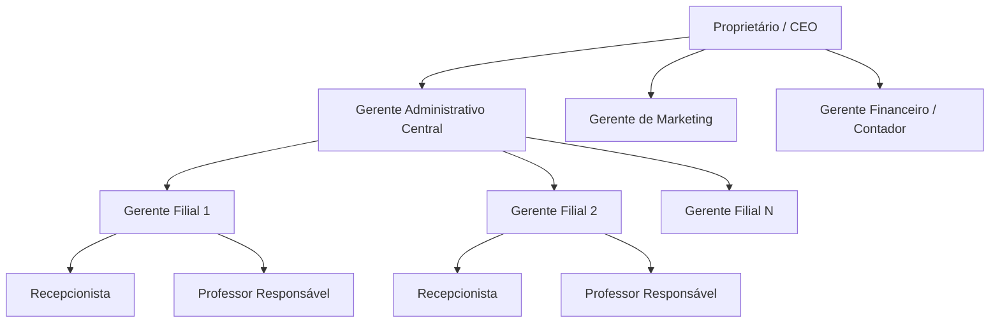
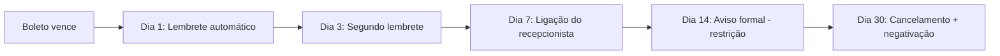
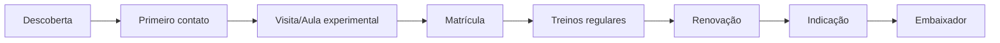
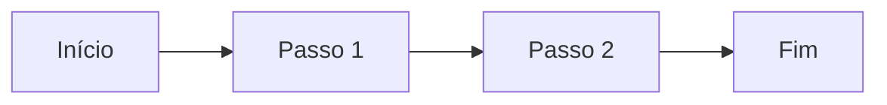
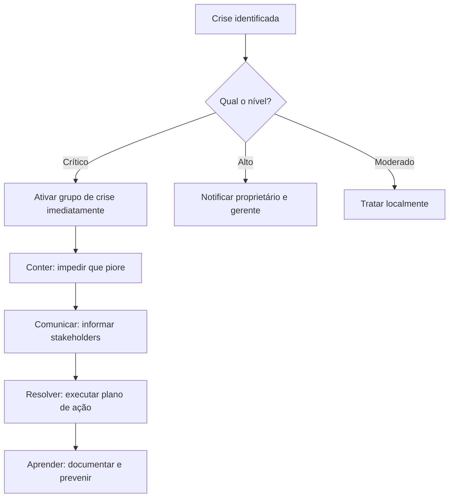
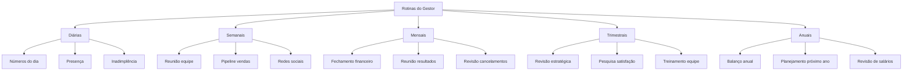

# Manual Completo de Gestão para Rede de Academias de Artes Marciais

> **Guia Prático do Proprietário — MMA, Boxe, Muay Thai e Jiu-Jitsu**

---

## Índice

1. [Fundamentos da Administração de Academias](#1-fundamentos-da-administração-de-academias)
2. [Como Organizar uma Empresa com Várias Unidades](#2-como-organizar-uma-empresa-com-várias-unidades)
3. [Estrutura Organizacional e Definição de Responsabilidades](#3-estrutura-organizacional-e-definição-de-responsabilidades)
4. [Gestão de Pessoas](#4-gestão-de-pessoas)
5. [Liderança e Desenvolvimento de Equipes](#5-liderança-e-desenvolvimento-de-equipes)
6. [Padronização de Processos entre Filiais](#6-padronização-de-processos-entre-filiais)
7. [Indicadores (KPIs)](#7-indicadores-kpis)
8. [Gestão Financeira](#8-gestão-financeira)
9. [Controle de Inadimplência](#9-controle-de-inadimplência)
10. [Gestão de Alunos](#10-gestão-de-alunos)
11. [Atendimento ao Cliente](#11-atendimento-ao-cliente)
12. [Marketing para Academias](#12-marketing-para-academias)
13. [Vendas de Planos e Produtos](#13-vendas-de-planos-e-produtos)
14. [Gestão de Estoque](#14-gestão-de-estoque)
15. [Planejamento Estratégico](#15-planejamento-estratégico)
16. [Metas e Acompanhamento de Resultados](#16-metas-e-acompanhamento-de-resultados)
17. [Expansão para Novas Filiais](#17-expansão-para-novas-filiais)
18. [Como Delegar sem Perder o Controle](#18-como-delegar-sem-perder-o-controle)
19. [Como Criar Processos Documentados (POPs)](#19-como-criar-processos-documentados-pops)
20. [Gestão de Crises](#20-gestão-de-crises)
21. [Gestão do Tempo do Proprietário](#21-gestão-do-tempo-do-proprietário)
22. [Ferramentas Digitais Recomendadas](#22-ferramentas-digitais-recomendadas)
23. [Rotinas do Gestor](#23-rotinas-do-gestor)
24. [Principais Erros e Como Evitá-los](#24-principais-erros-e-como-evitá-los)
25. [Estudos de Caso e Exemplos Práticos](#25-estudos-de-caso-e-exemplos-práticos)
26. [Checklists por Área](#26-checklists-por-área)
27. [Glossário Administrativo](#27-glossário-administrativo)

---

## 1. Fundamentos da Administração de Academias

### 1.1 O que é Administração e por que ela importa

Administração é o ato de **planejar, organizar, liderar e controlar** os recursos de um negócio para atingir objetivos. No caso de uma academia de artes marciais, isso significa:

- **Planejar**: definir metas de matrículas, receita e expansão.
- **Organizar**: estruturar equipes, processos e filiais.
- **Liderar**: motivar professores, recepcionistas e equipe administrativa.
- **Controlar**: acompanhar números, corrigir desvios e tomar decisões baseadas em dados.

> **Exemplo prático**: Se sua meta é aumentar em 20% o número de alunos no semestre, você precisa planejar campanhas de marketing, organizar a agenda dos professores, liderar a equipe de vendas e controlar semanalmente quantas matrículas foram feitas.

### 1.2 Diferença entre ser um bom lutador e ser um bom gestor

Muitos donos de academias são ex-lutadores ou atletas apaixonados pelo esporte. Porém, **ser excelente no tatame não significa ser excelente nos negócios**. A gestão exige habilidades diferentes:

| Habilidade de Lutador | Habilidade de Gestor |
|---|---|
| Disciplina nos treinos | Disciplina nos processos |
| Foco na técnica | Foco nos números |
| Competição individual | Gestão de equipe |
| Treinamento físico | Planejamento financeiro |
| Resiliência física | Resiliência emocional e estratégica |

### 1.3 Os 4 pilares de uma academia lucrativa

```
┌─────────────────────────────────────────────┐
│           ACADEMIA LUCRATIVA                │
├──────────┬──────────┬───────────┬───────────┤
│ ALUNOS   │ EQUIPE   │ PROCESSOS │ FINANÇAS  │
│ Qualidade│ Qualidade│ Padroniz. │ Saudáveis │
│ Volume   │ Engajada │ Eficientes│ Previstas  │
│ Fideliz. │ Capacit.│ Document. │ Controladas│
└──────────┴──────────┴───────────┴───────────┘
```

### 1.4 Checklist — Fundamentos

- [ ] Entendi que administração é uma habilidade separada de lutar
- [ ] Identifiquei minhas fraquezas como gestor
- [ ] Defini quem me ajuda na parte administrativa (contador, assessor)
- [ ] Comecei a olhar os números da academia pelo menos 1x por semana
- [ ] Separei as contas pessoais das contas do negócio

---

## 2. Como Organizar uma Empresa com Várias Unidades

### 2.1 Estrutura legal: Holding vs. filiais avulsas

Quando você tem várias academias, a forma como elas estão registradas influencia diretamente impostos, responsabilidade e controle.

| Modelo | Vantagens | Desvantagens |
|---|---|---|
| **Holding patrimonial** | Proteção patrimonial, planejamento sucessório, economia fiscal | Custo de constituição, burocracia |
| **CNPJ único com filiais** | Simplicidade administrativa | Sem proteção entre unidades |
| **CNPJs separados** | Flexibilidade para vender/fechar unidade | Mais trabalho contábil, mais custos |
| **Franquia** | Escalabilidade rápida | Menor controle, royalties |

> **Recomendação**: Consulte um advogado especializado e um contador para definir a melhor estrutura para o seu caso.

### 2.2 Centralização vs. Descentralização

| Função | Recomendação | Motivo |
|---|---|---|
| Financeiro | **Centralizado** | Controle unificado, visão geral |
| Marketing | **Centralizado** | Marca consistente, campanhas integradas |
| RH (admissão) | **Centralizado** | Padronização de critérios |
| Treinos / Grade | **Descentralizado** | Cada filial tem necessidades locais |
| Atendimento | **Descentralizado** | Rapidez na resposta ao aluno |
| Compras de estoque | **Centralizado** | Poder de compra maior |

### 2.3 Fluxograma de Organização da Rede



### 2.4 Checklist — Organização da Rede

- [ ] Definida a estrutura legal (holding, CNPJ único, etc.)
- [ ] Mapeadas todas as funções e para quem cada uma reporta
- [ ] Decidido o que é centralizado e o que é descentralizado
- [ ] Criado um organograma atualizado e disponível para todos
- [ ] Definidos os canais de comunicação entre filiais e central

---

## 3. Estrutura Organizacional e Definição de Responsabilidades

### 3.1 Modelo de Organograma para Rede de Academias

```
                        ┌──────────────────┐
                        │   PROPRIETÁRIO   │
                        │   (CEO / Dono)   │
                        └────────┬─────────┘
               ┌─────────────────┼─────────────────┐
               ▼                 ▼                  ▼
    ┌──────────────────┐ ┌───────────────┐ ┌─────────────────┐
    │ Gerente Adm/CFO  │ │ Gerente Mktg  │ │ Gerente Operac. │
    │ (Financeiro)     │ │ (Marketing)   │ │ (Academias)     │
    └────────┬─────────┘ └───────┬───────┘ └────────┬────────┘
             │                   │                   │
      ┌──────┴──────┐    ┌──────┴──────┐     ┌──────┴──────┐
      │ Contador    │    │ Social Media│     │ Ger. Filial 1│
      │ Ass. Admin. │    │ Designer    │     │ Ger. Filial 2│
      └─────────────┘    └─────────────┘     │ Ger. Filial N│
                                             └──────┬──────┘
                                          ┌─────────┼─────────┐
                                          ▼         ▼         ▼
                                     Recepcion. Prof. Resp. Auxiliar
```

### 3.2 Fichas de Responsabilidade (Job Description simplificada)

#### Proprietário / CEO
- **Responsabilidade final**: resultado financeiro e crescimento da rede
- **Faz**: define metas, aprova grandes gastos, negocia parcerias, liderança geral
- **Não faz**: atende aluno no balcão, ajusta Facebook, faz faxina

#### Gerente Administrativo / CFO
- **Responsabilidade**: saúde financeira de todas as filiais
- **Faz**: fluxo de caixa, relatórios, folha de pagamento, impostos, negotiating com fornecedores
- **Reporta para**: Proprietário

#### Gerente de Operações
- **Responsabilidade**: funcionamento diário de todas as filiais
- **Faz**: grade de horários, qualidade dos treinos, gestão de professores, atendimento
- **Reporta para**: Proprietário

#### Gerente de Marketing
- **Responsabilidade**: aquisição e retenção de alunos via marketing
- **Faz**: campanhas, redes sociais, tráfego pago, eventos, parcerias
- **Reporta para**: Proprietário

#### Gerente de Filial
- **Responsabilidade**: resultado daquela unidade específica
- **Faz**: gestão do dia a dia, equipe local, atendimento, inadimplência local
- **Reporta para**: Gerente de Operações

#### Professor
- **Responsabilidade**: qualidade técnica dos treinos e retenção de alunos
- **Faz**: planeja aula, executa treino, avalia alunos, comunica necessidades
- **Reporta para**: Gerente de Filial / Professor Responsável

#### Recepcionista
- **Responsabilidade**: primeira impressão do aluno, controle de frequência, vendas no balcão
- **Faz**: atende telefone, faz matrículas, controle de ponto, estoque de produtos
- **Reporta para**: Gerente de Filial

### 3.3 Checklist — Estrutura Organizacional

- [ ] Organograma criado e distribuído para toda equipe
- [ ] Fichas de responsabilidade escritas para cada cargo
- [ ] Definido quem reporta para quem em cada filial
- [ ] Criado e-mail corporativo e canais de comunicação oficiais
- [ ] Reuniões de alinhamento definidas (frequência, participantes, pauta)

---

## 4. Gestão de Pessoas

### 4.1 Processo seletivo para professores

| Etapa | O que fazer | Ferramenta |
|---|---|---|
| 1. Definir vaga | Qual arte marcial? Quantos alunos? Horário? | Ficha de vaga |
| 2. Divulgar | Instagram, indicação, grupos de luta | Mídia social |
| 3. Triagem | Verificar currículo, faixa, experiência | Planilha |
| 4. Entrevista | Conversa sobre filosofia, didática, disponibilidade | Roteiro |
| 5. Aula experimental | Ministrar uma aula para avaliar didática | Avaliação |
| 6. Teste técnico | Avaliar nível técnico (se necessário) | Checklist |
| 7. Proposta | Enviar proposta com salário, benefícios, expectativas | Documento |
| 8. Contratação | Assinar contrato, registrar na folha | Jurídico |

### 4.2 Contratação: CLT vs. Prestação de Serviço

> ⚠️ **Atenção**: A legislação trabalhista brasileira é rígida. Muitas relações que parecem "prestação de serviço" são reconhecidas como vínculo empregatício pela Justiça do Trabalho.

| Critério | CLT | Prestador (PJ) |
|---|---|---|
| Vínculo empregatício | Sim | Não |
| INSS e FGTS | Empresa paga | Prestador paga |
| Férias e 13º | Obrigatórios | Não se aplica |
| Horário fixo | Comum | Deve ser flexível |
| Exclusividade | Pode ter | Não pode ser exigida |
| Risco trabalhista | Baixo | Alto se descumprido |

> **Recomendação**: Para professores que trabalham em horário fixo, usam uniforme da academia e têm subordinação, o mais seguro é **CLT**. Consulte um advogado trabalhista.

### 4.3 Remuneração: salário fixo vs. variável vs. mix

| Modelo | Quando usar | Vantagem | Desvantagem |
|---|---|---|---|
| Salário fixo | Professores estáveis, dedicação integral | Previsibilidade para o professor | Pode gerar acomodação |
| Comissão por aluno | Professores iniciantes, aulas extras | Incentiva crescimento | Renda instável |
| Mix (fixo + variável) | Maioria dos casos (recomendado) | Equilíbrio entre segurança e incentivo | Mais complexo de calcular |
| Hora aula | Professores eventuais, workshops | Flexibilidade | Não garante dedicação |

> **Exemplo de modelo misto**:
> - Salário fixo: R$ 2.000,00
> - Comissão: R$ 15,00 por aluno ativo acima de 30 alunos na turma
> - Bônus: R$ 500,00 se a turma atingir 90% de frequência mensal

### 4.4 Gestão de recepcionistas

O recepcionista é o **primeiro contato** do aluno com a academia. Ele é vendedor, atendente e controlador.

**Responsabilidades essenciais:**
- Atender telefone e WhatsApp com cordialidade e rapidez
- Realizar matrículas e renovações
- Controlar frequência dos alunos
- Realizar cobranças e registrar pagamentos
- Manter estoque organizado
- Acompanhar inadimplência

**KPIs do recepcionista:**
- Tempo médio de resposta ao telefone/WhatsApp
- Número de matrículas realizadas no mês
- Taxa de conversão de visitantes em alunos
- Número de renovações realizadas
- Qualidade do atendimento (pesquisa de satisfação)

### 4.5 Checklist — Gestão de Pessoas

- [ ] Processo seletivo documentado para cada cargo
- [ ] Contratos de trabalho revisados por advogado
- [ ] Folha de pagamento organizada e em dia
- [ ] Avaliações de desempenho realizadas (mínimo 2x ao ano)
- [ ] Treinamento inicial (onboarding) padronizado para novos funcionários
- [ ] Benefícios definidos e comunicados (plano de saúde, desconto em suplementos, etc.)

---

## 5. Liderança e Desenvolvimento de Equipes

### 5.1 Estilos de liderança e quando usar cada um

| Estilo | Quando usar | Exemplo |
|---|---|---|
| **Autoritário** | Emergências, disciplina, prazo curto | "A aula começa às 18h. Não há exceção." |
| **Democrático** | Planejamento, brainstorm, mudanças de processo | "Qual grade de horários vocês acham melhor?" |
| **Coach (coaching)** | Desenvolvimento de lideranças | "O que você acha que pode melhorar na sua aula?" |
| **Laissez-faire** | Equipe muito experiente e madura | "Vou delegar a organização do torneio para você." |

> **Dica**: O melhor líder usa o **estilo certo para cada situação**, não apenas um estilo fixo.

### 5.2 Como dar feedback para professores e equipe

**Método SBW (Situação - Comportamento - Wish):**

1. **Situação**: Descreva o momento exato
2. **Comportamento**: O que a pessoa fez (ou deixou de fazer)
3. **Wish**: O que você espera que ela faça

> **Exemplo**:
> - **S**: "Na terça-feira, durante a aula de Muay Thai..."
> - **B**: "...vi que você não corrigiu a postura dos alunos no chute circular..."
> - **W**: "...gostaria que você sempre verificasse a execução técnica antes de avançar para o próximo movimento."

### 5.3 Plano de desenvolvimento da equipe

| Nível | O que oferecer | Exemplo |
|---|---|---|
| **Básico** | Onboarding, treinamento inicial | Curso de primeiros socorros, regras da academia |
| **Intermediário** | Capacitação contínua | Workshops de didática, cursos online |
| **Avançado** | Desenvolvimento de liderança | Formação de professores auxiliares, gestão de filial |
| **Estratégico** | Participação nos negócios | Sócio-administrador, participa de resultados |

### 5.4 Reuniões eficazes

**Reunião semanal de equipe (30-45 min):**
1. Aquecimento: algo positivo da semana (2 min)
2. Números: matrículas, inadimplência, frequência (5 min)
3. Pendências: o que ficou pendente da semana anterior (5 min)
4. Pauta: assuntos do dia (20 min)
5. Ações: quem faz o quê até quando (5 min)
6. Encerramento: motivar o time (3 min)

### 5.5 Checklist — Liderança

- [ ] Definido meu estilo de liderança predominante
- [ ] Criado rotina de feedbacks (mínimo 1x por mês)
- [ ] Reuniões de equipe agendadas e com pauta fixa
- [ ] Identificados os potenciais líderes na equipe
- [ ] Plano de capacitação elaborado para cada cargo

---

## 6. Padronização de Processos entre Filiais

### 6.1 Por que padronizar?

Quando cada filial funciona de um jeito diferente, você tem:
- Inconsistência na experiência do aluno
- Dificuldade de controle e comparação de resultados
- Problemas quando um funcionário troca de filial
- Impossibilidade de escalar o negócio

### 6.2 O que padronizar em cada filial

| Área | O que padronizar | Documento |
|---|---|---|
| **Atendimento** | Script de atendimento, saudação, processo de matrícula | POP Atendimento |
| **Financeiro** | Formas de pagamento, regras de desconto, cancelamento | POP Financeiro |
| **Operacional** | Grade de horários, limpeza, segurança, manutenção | POP Operacional |
| **Professores** | Plano de aula, avaliação de alunos, uniforme | POP Professores |
| **Estoque** | Processo de compra, entrada/saída, inventário | POP Estoque |
| **Marketing** | Identidade visual, tom de voz, publicações | Manual de Marca |

### 6.3 Como criar um POP (Procedimento Operacional Padrão)

**Passo a passo:**

1. **Identifique o processo**: O que precisa ser padronizado?
2. **Mapeie as etapas**: Liste cada passo, na ordem correta
3. **Defina responsáveis**: Quem faz cada etapa?
4. **Estabeleça prazos**: Em quanto tempo cada etapa deve ser concluída?
5. **Crie o documento**: Use linguagem simples, com listas e imagens
6. **Teste com a equipe**: Valide se o documento é claro e aplicável
7. **Treine**: Capacite todos os envolvidos
8. **Implemente**: Coloque em prática
9. **Monitore**: Verifique se está sendo seguido
10. **Revise e atualize**: Melhore continuamente

> **Exemplo de POP — Processo de Matrícula:**
>
> 1. Recepcionista receives o aluno (presencial ou WhatsApp)
> 2. Apresenta as modalidades e planos disponíveis
> 3. Oferece a aula experimental gratuita
> 4. Após a aula, senta com o aluno e apresenta os valores
> 5. Realiza a matrícula no sistema
> 6. Coleta documentos (RG, CPF, comprovante de residência, laudo médico)
> 7. Emite o primeiro boleto ou registra pagamento
> 8. Entrega o uniforme (se incluído no plano)
> 9. Apresenta o horário e o professor da turma
> 10. Agenda contato de boas-vindas para 7 dias depois

### 6.4 Checklist — Padronização

- [ ] Todos os processos críticos mapeados
- [ ] POPs escritos para cada processo crítico
- [ ] POPs revisados e aprovados pela equipe
- [ ] Treinamento sobre POPs realizado para todos os funcionários
- [ ] POPs acessíveis (pasta compartilhada, quadro na cozinha, etc.)
- [ ] Revisão agendada a cada 6 meses

---

## 7. Indicadores (KPIs)

### 7.1 O que são KPIs e por que importam

KPIs (Key Performance Indicators) são os **números que contam a história do seu negócio**. Sem eles, você está dirigindo no escuro.

### 7.2 KPIs Diários

| KPI | Como medir | Meta sugerida |
|---|---|---|
| **Presença nos treinos** | Contagem de alunos presentes | Acima de 70% da capacidade |
| **Novas visitas agendadas** | Controle no sistema | Mínimo 2 por filial/dia |
| **Matrículas realizadas** | Sistema de gestão | Mínimo 1 por filial/dia |
| **Recebimentos do dia** | Caixa/PIX/cartão | Conforme meta financeira |
| **Inadimplência** | Relatório do sistema | Abaixo de 10% |

### 7.3 KPIs Semanais

| KPI | Como medir | Meta sugerida |
|---|---|---|
| **Frequência média dos alunos** | Presença / matriculados | Acima de 50% |
| **Taxa de conversão de visitas** | Matrículas / visitas | Acima de 30% |
| **Receita semanal** | Soma dos recebimentos | Conforme orçamento |
| **Churn (cancelamentos)** | Cancelamentos / total de alunos | Abaixo de 5% ao mês |
| **NPS (satisfação)** | Pesquisa rápida | Acima de 8 |

### 7.4 KPIs Mensais

| KPI | Como medir | Meta sugerida |
|---|---|---|
| **Receita bruta mensal** | Total faturado | Crescimento mês a mês |
| **Lucro líquido** | Receita - Custos - Despesas | Acima de 15% da receita |
| **Ticket médio** | Receita total / alunos ativos | Crescente |
| **LTV (Lifetime Value)** | Ticket médio x tempo médio de permanência | Acima de 12 meses |
| **CAC (Custo de Aquisição)** | Gasto com marketing / novos alunos | Inferior ao ticket médio |
| **ROAS** | Receita gerada / gasto em marketing | Acima de 5x |
| **Inadimplência mensal** | Inadimplentes / total de alunos | Abaixo de 8% |
| **Nº total de alunos ativos** | Contagem no sistema | Crescente |
| **Margem de contribuição** | (Receita - CVV) / Receita | Acima de 40% |
| **Giro de estoque** | Custo estoque vendido / estoque médio | Acima de 4x/ano |

### 7.5 Dashboard simplificado do proprietário

```
╔═══════════════════════════════════════════════════════════════╗
║                    PAINEL DO PROPRIETÁRIO                     ║
║                    Mês de _______________                     ║
╠═══════════════════════════════════════════════════════════════╣
║                                                               ║
║  ALUNOS          FINANÇAS         MARKETING      OPERAÇÃO     ║
║  ─────────       ─────────        ─────────      ─────────    ║
║  Ativos: ____    Receita: R$ ____  Visitas: ___  Frequent.: % ║
║  Novos:  ____    Custos:  R$ ____  Conversão: %  Renovações: %║
║  Saídas: ____    Lucro:   R$ ____  CAC: R$ ____  Cancelam.: % ║
║  Total:  ____    Margem:     %     ROAS: ____x  NPS: ___/10  ║
║                                                               ║
╚═══════════════════════════════════════════════════════════════╝
```

### 7.6 Checklist — KPIs

- [ ] KPIs diários definidos e monitorados
- [ ] KPIs semanais definidos e monitorados
- [ ] KPIs mensais definidos e monitorados
- [ ] Dashboard criado (pode ser no Excel/Google Sheets)
- [ ] Relatórios sendo gerados automaticamente (ou pelo menos semanalmente)
- [ ] Metas definidas para cada KPI

---

## 8. Gestão Financeira

### 8.1 Fluxo de Caixa

O fluxo de caixa é o **coração do negócio**. Ele mostra quanto dinheiro entra e sai, e quando.

**Princípio fundamental**: Dinheiro na conta ≠ Lucro. Um negócio pode faturar R$ 100 mil/mês e estar quebrado se os custos forem R$ 110 mil.

#### Como montar um fluxo de caixa simplificado

| Dia | Entradas | Saídas | Saldo do dia | Saldo acumulado |
|---|---|---|---|---|
| 01/Jul | R$ 5.000 (mensalidades) | R$ 3.000 (salários) | R$ 2.000 | R$ 2.000 |
| 05/Jul | R$ 1.500 (matrículas) | R$ 1.200 (aluguel) | R$ 300 | R$ 2.300 |
| 10/Jul | R$ 2.000 (suplementos) | R$ 800 (energia) | R$ 1.200 | R$ 3.500 |
| ... | ... | ... | ... | ... |

> **Regra de ouro**: Ter previsão de fluxo de caixa para os próximos **90 dias**.

### 8.2 Controle de Custos

#### Classificação de custos de uma academia

| Categoria | Exemplos | % ideal da receita |
|---|---|---|
| **Custos fixos** | Aluguel, salários fixos, condomínio, internet | 40-50% |
| **Custos variáveis** | Comissões, horas extras, materiais descartáveis | 10-15% |
| **Despesas operacionais** | Energia, água, manutenção, limpeza | 10-15% |
| **Despesas administrativas** | Contador, software, escritório | 5-8% |
| **Despesas de marketing** | Tráfego pago, materiais, eventos | 5-10% |
| **Impostos** | Simples Nacional, ISS, PIS/COFINS | 6-15% |
| **Lucro líquido** | Sobra | 15-25% |

> **Atenção**: Esses são valores de referência. Cada negócio realidade diferente. O importante é **monitorar e comparar mês a mês**.

### 8.3 Precificação dos planos

**Como calcular o preço mínimo de um plano:**

```
Preço mínimo = (Custo fixo por aluno + Custo variável por aluno) × Margem desejada
```

**Passo a passo:**

1. Some todos os custos fixos mensais da filial (aluguel + salários + energia + etc.)
2. Divida pelo número ideal de alunos para aquela filial
3. Adicione o custo variável por aluno (material, comissão, etc.)
4. Adicione a margem de lucro desejada (mínimo 20%)

> **Exemplo**:
> - Custos fixos: R$ 15.000/mês
> - Capacidade ideal: 150 alunos
> - Custo fixo por aluno: R$ 100,00
> - Custo variável por aluno: R$ 15,00 (comissão, material)
> - Margem desejada: 25%
> - Preço mínimo: (R$ 100 + R$ 15) × 1,25 = **R$ 143,75**

### 8.4 Lucro e Margem

| Conceito | Fórmula | Exemplo |
|---|---|---|
| **Receita bruta** | Total de faturamento | R$ 50.000 |
| **Receita líquida** | Receita bruta - impostos | R$ 43.500 |
| **Custo dos serviços prestados (CVV)** | Professores + materiais diretos | R$ 18.000 |
| **Lucro bruto** | Receita líquida - CVV | R$ 25.500 |
| **Despesas operacionais** | Aluguel, energia, admin, etc. | R$ 15.000 |
| **Lucro operacional** | Lucro bruto - Despesas | R$ 10.500 |
| **Lucro líquido** | Lucro operacional - IR/CSLL | R$ 8.400 |
| **Margem líquida** | Lucro líquido / Receita bruta | 16,8% |

### 8.5 Margem de Contribuição

A margem de contribuição responde: **cada aluno novo quanto contribui para cobrir os custos fixos e gerar lucro?**

```
Margem de contribuição = (Preço de venda - Custo variável unitário) / Preço de venda × 100
```

> **Exemplo**:
> - Mensalidade: R$ 200,00
> - Custo variável por aluno (comissão professor, material): R$ 30,00
> - Margem de contribuição: (200 - 30) / 200 × 100 = **85%**

Quanto maior a margem de contribuição, mais rápido você cobre os custos fixos e começa a ter lucro.

### 8.6 Capital de Giro

Capital de giro é o **dinheiro disponível para funcionar no dia a dia** — pagar fornecedores, salários e contas enquanto espera receber dos alunos.

**Regra**: Ter capital de giro para cobrir pelo menos **3 meses de custos fixos**.

> **Exemplo**: Se seus custos fixos mensais são R$ 20.000,00, você deve ter pelo menos R$ 60.000,00 em capital de giro disponível.

### 8.7 Reserva Financeira

Reserva financeira é diferente de capital de giro. É o dinheiro guardado para **emergências**: pandemia, reforma inesperada, processo judicial, queda de alunos.

**Regra**: Ter reserva para cobrir **6 a 12 meses de custos fixos**.

**Como construir a reserva:**
1. Defina um valor-alvo (ex: R$ 120.000)
2. Transfira todo mês um valor fixo para uma conta separada
3. Não toque nesse dinheiro para nada que não seja emergência
4. Quando usar, repor o mais rápido possível

### 8.8 Checklist — Gestão Financeira

- [ ] Fluxo de caixa projetado para os próximos 90 dias
- [ ] Controle de custos categorizado e atualizado mensalmente
- [ ] Preço dos planos calculado com base em custos reais
- [ ] Margem de contribuição de cada plano conhecida
- [ ] Capital de giro equivalente a 3 meses de custos fixos
- [ ] Reserva financeira em construção (meta: 6-12 meses)
- [ ] Contas pessoais separadas das contas do negócio
- [ ] Revisão financeira mensal com contador

---

## 9. Controle de Inadimplência

### 9.1 O que é inadimplência e por que ela mata academias

Inadimplência é quando o aluno **não paga no prazo**. Uma inadimplência de 15-20% pode significar a diferença entre lucro e prejuízo.

> **Exemplo**: Se você tem 200 alunos pagando R$ 200/mês (R$ 40.000 de receita) e 15% estão inadimplidos (R$ 6.000 perdidos), seu lucro pode cair pela metade ou mais.

### 9.2 Pipeline de cobrança



### 9.3 Estratégias para reduzir inadimplência

| Estratégia | Como implementar | Impacto |
|---|---|---|
| **Débito automático** | Oferecer desconto para débito automado | Reduz inadimplência em até 50% |
| **PIX** | Enviar link de pagamento por WhatsApp | Pagamento mais rápido |
| **Desconto pontualidade** | 5-10% de desconto para pagamento até o 5º dia | Incentiva pagamento antecipado |
| **Restrição de acesso** | Aluno inadimplente não treina | Pressão positiva para pagamento |
| **Negativação** | Cadastrar nos órgãos de proteção | Último recurso, muito eficaz |
| **Cobrança proativa** | Ligar antes do vencimento | Evita o atraso |

### 9.4 Relatório de inadimplência

| Aluno | Plano | Vencimento | Valor | Dias atraso | Status | Ação |
|---|---|---|---|---|---|---|
| João Silva | Mensal | 05/07 | R$ 200 | 10 | 2ª ligação | Agendar visita |
| Maria Santos | Trimestral | 01/07 | R$ 540 | 14 | Aviso formal | Restrição + negativação |
| Pedro Lima | Anual | 01/06 | R$ 1.800 | 36 | Negativação | Advogado |

### 9.5 Checklist — Inadimplência

- [ ] Sistema de envio de boleto automático configurado
- [ ] Lembrete automático por WhatsApp/SMS ativo
- [ ] Recepcionista orientada sobre processo de cobrança
- [ ] Relatório de inadimplência revisado semanalmente
- [ ] Política de restrição de acesso documentada e comunicada
- [ ] Processo de negativação definido (quando e como usar)
- [ ] Meta de inadimplência definida (ideal: abaixo de 8%)

---

## 10. Gestão de Alunos

### 10.1 Matrículas

**Checklist de matrícula:**
- [ ] Dados pessoais coletados (RG, CPF, endereço, telefone, e-mail)
- [ ] Laudo médico apresentado (ou declaração de aptidão)
- [ ] Termo de responsabilidade assinado
- [ ] Plano escolhido e pagamento realizado
- [ ] Uniforme entregue (se aplicável)
- [ ] Aluno apresentado ao professor e à turma
- [ ] Contato de emergência registrado
- [ ] Dados cadastrados no sistema de gestão

### 10.2 Renovações

A renovação é o momento mais importante para manter o aluno. **Não espere o último dia.**

**Cronograma de renovação:**

| Tempo antes do vencimento | Ação |
|---|---|
| 30 dias | Primeiro contato: "Seu plano vence em 30 dias. Que tal renovar com condição especial?" |
| 15 dias | Segundo contato: "Restam 15 dias. Aproveite o desconto de renovar antecipado." |
| 7 dias | Terceiro contato: "Sua última semana. Não perca os benefícios." |
| Vencimento | Contato final: "Seu plano vence hoje. Podemos renovar agora?" |
| Pós-vencimento | Iniciar processo de cobrança e tentativa de retenção |

### 10.3 Cancelamentos

**Motivos comuns de cancelamento e como prevenir:**

| Motivo | Prevenção |
|---|---|
| **Falta de resultado** | Avaliações regulares, metas individuais, acompanhamento do professor |
| **Preço alto** | Oferecer planos com diferentes faixas de preço, desconto por fidelidade |
| **Falta de tempo** | Aulas em múltiplos horários, modalidades flexíveis |
| **Mudança de endereço** | Oferecer transferência para outra filial |
| **Problema com professor** | Feedback dos alunos, troca de turma, mediação |
| **Tédio / monotonia** | Variedade de treinos, eventos, competições, graduações |
| **Lesão** | Aulas adaptadas, acompanhamento preventivo, parceria com fisioterapeuta |

**Entrevista de saída (obrigatória):**
- [ ] Perguntar o motivo real do cancelamento
- [ ] Oferecer alternativas (troca de turma, suspensão, plano mais barato)
- [ ] Registrar motivo no sistema
- [ ] Agendar contato para 3 meses depois (tentativa de retorno)

### 10.4 Retenção

Retenção é **manter o aluno antes que ele pense em sair**. A melhor retenção é a preventiva.

**Estratégias de retenção:**

| Estratégia | Implementação |
|---|---|
| **Avaliação física mensal** | Professor registra evolução e compartilha com o aluno |
| **Graduação cerimonial** | Faixas, certificados, conquistas visíveis |
| **Comunidade** | Grupo de WhatsApp, eventos sociais, churrascos |
| **Personalização** | Conhecer o nome de cada aluno, saber seus objetivos |
| **Desafios** | Competições internas, desafios mensais, rankings |
| **Contato regular** | Ligação/WhatsApp do professor ou gerente a cada 30 dias |

### 10.5 Fidelização

Fidelizar vai além de reter — é fazer o aluno **não querer sair nunca**.

**Pirâmide da fidelização:**

```
        ┌──────────────┐
        │  EMBAIXADOR   │  ← Indica novos alunos, defende a marca
        ├──────────────┤
        │  PROMOTOR     │  ← Participa de eventos, indica naturalmente
        ├──────────────┤
        │  SATISFEITO   │  ← Gosta da academia, recomenda se perguntado
        ├──────────────┤
        │  NEUTRO       │  ← Não tem opinião forte, pode sair
        ├──────────────┤
        │  INSATISFEITO │  ← Não recomenda, pode sair a qualquer momento
        └──────────────┘
```

**Como transformar alunos em embaixadores:**
1. Programa de indicação: aluno que indicar ganha desconto ou brinde
2. Mural de fotos: alunos que se gradueram, conquistaram medalhas
3. Redes sociais: postar conquistas dos alunos (com autorização)
4. Eventos exclusivos:-only para alunos ativos

### 10.6 Checklist — Gestão de Alunos

- [ ] Processo de matrícula padronizado e documentado
- [ ] Cronograma de renovação implementado (30, 15, 7 dias antes)
- [ ] Entrevista de saída realizada para todo cancelamento
- [ ] Sistema de retenção ativo (avaliações, contato regular)
- [ ] Programa de indicação funcionando
- [ ] Relatório de evasão analisado mensalmente
- [ ] Lista de alunos inativos/evadidos para campanha de retorno

---

## 11. Atendimento ao Cliente

### 11.1 O momento da verdade

O atendimento ao cliente em uma academia começa **antes** da matrícula e continua **durante toda a jornada do aluno**.

### 11.2 Jornada do aluno



### 11.3 Script de atendimento telefônico/WhatsApp

> **Exemplo**:
>
> *"Olá, [Nome da Academia]! Aqui é o(a) [Nome do recepcionista]. Como posso ajudar?"*
>
> Se o cliente quer saber sobre planos:
>
> *"Que ótimo! Você já pratica alguma arte marcial? Nós oferecemos [modalidades]. Posso te agendar uma aula experimental gratuita para você conhecer? É sem compromisso!"*

### 11.4 Regras de atendimento

| Regra | Por quê |
|---|---|
| Responder WhatsApp em até 5 minutos | Mais de 50% dos leads são perdidos após 10 minutos |
| Nunca dizer "não sei" sem oferecer alternativa | "Não sei, vou verificar e retorno em X minutos" |
| Conhecer o nome do aluno | Cria vínculo e valorização |
| Jamais discutir com o aluno | Escalar para o gerente se necessário |
| Ligar para alunos ausentes após 3 faltas | Demonstra interesse e previne evasão |
| Pesquisa de satisfação trimestral | Identificar problemas antes que virem cancelamentos |

### 11.5 Tratamento de reclamações

**Método HEARD:**

1. **H**ear (Ouça): Deixe o cliente falar sem interromper
2. **E**mpathize (Empatia): "Entendo sua frustração, seria chateado se estivesse no seu lugar"
3. **A**pologize (Desculpe-se): "Peço desculpas pela inconveniência"
4. **R**esolve (Resolva): Ofereça uma solução concreta
5. **D**ocument (Documente): Registre a reclamação e a solução

### 11.6 Checklist — Atendimento

- [ ] Script de atendimento criado e memorizado pela equipe
- [ ] Tempo de resposta definido (WhatsApp: 5 min, telefone: 3 toques)
- [ ] Reclamações sendo registradas em local adequado
- [ ] Pesquisa de satisfação realizada trimestralmente
- [ ] Ligações para alunos ausentes sendo realizadas
- [ ] Treinamento de atendimento realizado para toda equipe

---

## 12. Marketing para Academias

### 12.1 O funil de marketing da academia

```
┌─────────────────────────────────────────────────┐
│  TOPO DE FUNIL (AWARENESS)                      │
│  Objetivo: Ser conhecido                        │
│  Ações: Redes sociais, Google, indicação, mural │
├─────────────────────────────────────────────────┤
│  MEIO DE FUNIL (CONSIDERAÇÃO)                   │
│  Objetivo: Gerar interesse                      │
│  Ações: Aula experimental, conteúdo educativo,  │
│         depoimentos, tour pela academia         │
├─────────────────────────────────────────────────┤
│  FUNDO DE FUNIL (DECISÃO)                       │
│  Objetivo: Fechar a matrícula                   │
│  Ações: Proposta comercial, desconto, bônus,    │
│         prova social, urgência                  │
├─────────────────────────────────────────────────┤
│  PÓS-VENDA (RETENÇÃO)                           │
│  Objetivo: Manter e fidelizar                   │
│  Ações: Acompanhamento, eventos, graduações,    │
│         programa de indicação                   │
└─────────────────────────────────────────────────┘
```

### 12.2 Canais de marketing mais eficazes para academias

| Canal | Custo | Impacto | Prioridade |
|---|---|---|---|
| **Indicação de alunos** | Baixo | Muito alto | ★★★★★ |
| **Instagram** | Baixo/Médio | Alto | ★★★★★ |
| **Google Meu Negócio** | Grátis | Alto | ★★★★★ |
| **WhatsApp Business** | Grátis | Alto | ★★★★★ |
| **Tráfego pago (Meta/Google)** | Médio | Alto | ★★★★☆ |
| **Parcerias locais** | Baixo | Médio | ★★★☆☆ |
| **Eventos e torneios** | Médio | Alto | ★★★★☆ |
| **Flyers e outdoors** | Baixo | Baixo/Médio | ★★☆☆☆ |

### 12.3 Programa de indicação

**Como funciona:**

| Ação do aluno indicado | Recompensa para quem indicou |
|---|---|
| O aluno indica um amigo | Recebe 1 mês grátis ou desconto |
| O amigo faz aula experimental | Bônus de R$ 50,00 em produtos |
| O amigo se matricula | +1 mês grátis ou upgrade de plano |

> **Dica**: Tornar o programa simples e fácil de entender. Evite regras complexas.

### 12.4 Calendário de conteúdo (Instagram)

| Dia | Tipo de conteúdo | Exemplo |
|---|---|---|
| Segunda | Motivação | Frase inspiradora + foto do treino |
| Terça | Educativo | "3 erros comuns no chute circular" |
| Quarta | Depoimento | Aluno compartilhando resultado |
| Quinta | Bastidores | Preparação da aula, equipe |
| Sexta | Convite | "Aula experimental sábado às 10h" |
| Sábado | Evento/Resultado | Fotos de competição, graduação |
| Domingo | Comunidade | Post do grupo, churrasco, social |

### 12.5 Checklist — Marketing

- [ ] Perfil do Instagram otimizado (bio, link, highlight)
- [ ] Google Meu Negócio atualizado com fotos, horários, avaliações
- [ ] Programa de indicação criado e comunicado aos alunos
- [ ] Calendário de conteúdo mensal planejado
- [ ] Aula experimental disponível e promovida
- [ ] Campanhas de início de mês/ano planejadas
- [ ] Orçamento mensal de marketing definido (5-10% da receita)
- [ ] Métricas de marketing acompanhadas (alcance, leads, conversão)

---

## 13. Vendas de Planos e Produtos

### 13.1 Estrutura de planos recomendada

| Plano | Preço | Benefícios | Público-alvo |
|---|---|---|---|
| **Básico** | R$ 150-180 | 1 modalidade, 3x/semana | Iniciantes, budget |
| **Intermediário** | R$ 200-250 | 2 modalidades, ilimitado | Praticantes regulares |
| **Premium** | R$ 300-350 | Todas modalidades + aulas extras | Dedicados, competidores |
| **Família** | R$ 400-500 | 2+ membros, desconto por pessoa | Famílias |
| **Anual** | 10-20% desconto | Compromisso de 12 meses | Fidelizados |
| **Corporate** | R$ 120-160/pessoa | Para empresas, grupo | Empresas parceiras |

### 13.2 Técnicas de venda no balcão

**Método SPIN:**

1. **S**ituação: "Você pratica alguma atividade física atualmente?"
2. **P**roblema: "O que sente falta nos seus treinos atuais?"
3. **I**mplicação: "Isso interfere na sua disposão no dia a dia?"
4. **N**ecessidade: "E se você pudesse ter aulas personalizadas de Muay Thai e Jiu-Jitsu, com professores campeões?"

### 13.3 Upsell e cross-sell

| Produto | Upsell | Cross-sell |
|---|---|---|
| Plano básico | Upgrade para intermediário | Suplementos, uniforme |
| Plano mensal | Upgrade para trimestral/anual | Personal trainer, campeonatos |
| Mensalidade | Pacote de aulas particulares | Kimono, luvas, equipamentos |

### 13.4 Venda de produtos

**Produtos que toda academia deveria vender:**

| Produto | Margem | Demanda |
|---|---|---|
| Luvas de MMA/Boxe | 30-50% | Alta |
| Kimono de Jiu-Jitsu | 40-60% | Alta |
| Suplementos (whey, creatina) | 20-35% | Alta |
| Uniforme da academia (camiseta) | 50-70% | Média |
| Bandagem/Hand wrap | 40-60% | Alta |
| Protetor bucal | 30-50% | Média |
| Garrafa/taca personalizada | 60-80% | Média |

### 13.5 Checklist — Vendas

- [ ] Planos estruturados com preços calculados
- [ ] Script de vendas treinado para recepcionistas
- [ ] Processo de upsell/cross-sell definido
- [ ] Produtos disponíveis para venda no balcão
- [ ] Formas de pagamento variadas (PIX, cartão, boleto)
- [ ] Fluxo de follow-up para leads que não fecharam na primeira visita
- [ ] Metas de vendas definidas para a equipe

---

## 14. Gestão de Estoque

### 14.1 O que gerenciar no estoque

| Categoria | Itens | Frequência de contagem |
|---|---|---|
| **Equipamentos de luta** | Luvas, sombrancelheiras, capacetes, protetores | Mensal |
| **Vestuário** | Kimonos, camisetas, calças, faixas | Quinzenal |
| **Suplementos** | Whey, creatina, pré-treino, vitaminas | Semanal |
| **Descartáveis** | Bandagens, wraps, enxaguante | Quinzenal |
| **Materiais de limpeza** | Produtos de limpeza do tatame | Mensal |
| **Uniformes** | Uniformes para funcionários | Trimestral |

### 14.2 Método de controle: Planilha simples

| Produto | Estoque inicial | Entradas | Saídas (venda) | Saídas (uso interno) | Estoque final | Ponto de reposição |
|---|---|---|---|---|---|---|
| Luva MMA | 50 | 20 | 15 | 2 | 53 | 30 |
| Kimono | 30 | 10 | 8 | 0 | 32 | 15 |
| Whey 1kg | 20 | 15 | 12 | 0 | 23 | 10 |
| Bandagem | 100 | 50 | 30 | 10 | 110 | 40 |

### 14.3 Regras de estoque

1. **Ponto de reposição**: Quando o estoque chega a determinado nível, fazer novo pedido
2. **PEPS** (Primeiro que Entra, Primeiro que Sai): Use o produto mais antigo primeiro
3. **Inventário mensal**: Contar tudo no final do mês e comparar com a planilha
4. **Fornecedor confiável**: Ter pelo menos 2 fornecedores para cada categoria importante
5. **Margem mínima**: Produtos devem ter no mínimo 25% de margem

### 14.4 Checklist — Estoque

- [ ] Planilha de estoque criada e atualizada
- [ ] Ponto de reposição definido para cada produto
- [ ] Inventário mensal realizado
- [ ] Fornecedores cadastrados com preços comparados
- [ ] Produtos organizados (etiquetas, prateleiras)
- [ ] Perdas e extravios registrados e investigados
- [ ] Margem de cada produto calculada e monitorada

---

## 15. Planejamento Estratégico

### 15.1 Análise SWOT para academias

| | Positivo | Negativo |
|---|---|---|
| **Interno** | **Forças**: Professores renomados, localização boa, comunidade forte | **Frquezas**: Processos não documentados, alta inadimplência, sem reserva |
| **Externo** | **Oportunidades**: Crescimento do MMA, mercado em alta, franquias | **Ameaças**: Nova academia no bairro, crise econômica, COVID |

### 15.2 Definição de visão, missão e valores

> **Visão**: "Ser a maior rede de artes marciais do estado, reconhecida pela excelência no ensino e na formação de campeões."
>
> **Missão**: "Transformar vidas através das artes marciais, oferecendo treinamento de alta qualidade em um ambiente familiar e motivador."
>
> **Valores**: Respeito, Disciplina, Comunidade, Excelência, Honestidade.

### 15.3 Planos estratégicos por horizonte

| Horizonte | Tipo de plano | Exemplo |
|---|---|---|
| **Curto prazo** (3-6 meses) | Tático | Reduzir inadimplência de 15% para 8% |
| **Médio prazo** (6-12 meses) | Operacional | Abrir 2ª filial, contratar 3 professores |
| **Longo prazo** (1-5 anos) | Estratégico | Tornar rede com 5 filiais, R$ 500k/mês de receita |

### 15.4 Checklist — Planejamento

- [ ] Análise SWOT realizada e documentada
- [ ] Visão, missão e valores definidos
- [ ] Metas de curto, médio e longo prazo estabelecidas
- [ ] Plano anual de ações criado com responsável e prazo para cada ação
- [ ] Revisão estratégica trimestral agendada

---

## 16. Metas e Acompanhamento de Resultados

### 16.1 Método SMART para definição de metas

| Critério | Significado | Exemplo |
|---|---|---|
| **S**pecífica | Clara e definida | Aumentar número de alunos |
| **M**ensurável | Pode ser medida | De 150 para 180 alunos |
| **A**lcançável | Realista | 20% de crescimento em 6 meses |
| **R**elevante | Importante para o negócio | Mais alunos = mais receita |
| **T**emporal | Com prazo definido | Até 31/12/2026 |

> **Meta SMART**: "Aumentar o número de alunos ativos de 150 para 180 (+20%) na Filial 1 até 31/12/2026, através de campanhas de marketing e redução de cancelamentos."

### 16.2 Cascata de metas

```
META DA REDE: Aumentar receita em 30% no ano
    │
    ├── FILIAL 1: Aumentar alunos de 150 para 195
    │       ├── Marketing: Gerar 40 visitas/mês
    │       ├── Vendas: Converter 40% das visitas
    │       └── Operação: Reduzir cancelamentos em 30%
    │
    ├── FILIAL 2: Aumentar alunos de 100 para 130
    │       ├── Marketing: Gerar 30 visitas/mês
    │       ├── Vendas: Converter 35% das visitas
    │       └── Operação: Reduzir cancelamentos em 25%
    │
    └── FILIAL 3: Aumentar alunos de 80 para 104
            ├── Marketing: Gerar 25 visitas/mês
            ├── Vendas: Converter 35% das visitas
            └── Operação: Reduzir cancelamentos em 25%
```

### 16.3 Acompanhamento de resultados

**Reunião mensal de resultados (pauta):**

1. Resultado financeiro do mês (receita, custos, lucro)
2. Comparativo com meta e com mês anterior
3. Nº de alunos: entradas, saídas, total
4. Inadimplência
5. Marketing: investimento vs. resultados
6. Ações do mês seguinte

### 16.4 Checklist — Metas

- [ ] Metas SMART definidas para a rede e cada filial
- [ ] Cascata de metas comunicada a todos os líderes
- [ ] Dashboard de acompanhamento atualizado semanalmente
- [ ] Reunião mensal de resultados realizada
- [ ] Ajustes de estratégia feitos quando necessário
- [ ] Metas revistas trimestralmente

---

## 17. Expansão para Novas Filiais

### 17.1 Quando expandir

**Sinais de que é hora de expandir:**
- Filial atual está no ponto de equilíbrio ou lucro há 12+ meses
- Fluxo de caixa positivo consistente
- Equipe qualificada e processos documentados
- Demanda insatisfeita (alunos na fila, procura de outras regiões)
- Reserva financeira para cobrir os primeiros 6 meses da nova filial

**Sinais de que NÃO é hora:**
- Filial atual ainda não dá lucro
- Processos não padronizados
- Equipe não preparada para liderar nova unidade
- Sem capital suficiente
- Dono sobrecarregado (não consegue gerir a atual)

### 17.2 Checklist para abertura de nova filial

- [ ] Viabilidade financeira calculada (investimento, payback, ponto de equilíbrio)
- [ ] Localização pesquisada (concorrência, fluxo, demografia)
- [ ] Contrato de locais assinado (com cláusula de saída)
- [ ] Reforma e adaptação do espaço planejadas
- [ ] Equipamentos e materiais comprados
- [ ] Equipe contratada e treinada
- [ ] Sistema de gestão implementado
- [ ] Campanha de lançamento planejada (30 dias antes, no dia, 30 dias depois)
- [ ] Capital de giro separado para a nova filial
- [ ] Processos padronizados implementados

### 17.3 Erros comuns na expansão

| Erro | Como evitar |
|---|---|
| Abrir antes da hora | Ter 12+ meses de lucro na filial atual |
| Não ter processos | Documentar tudo ANTES de expandir |
| Contratar às pressas | Ter tempo mínimo de 30 dias para contratação |
| Superestimar receita | Usar dados conservadores |
| Subestimar custos | Adicionar 20% de margem de segurança |
| Não dedicar tempo | Designar um responsável pela nova filial |

### 17.4 Checklist — Expansão

- [ ] Análise de viabilidade realizada
- [ ] Localização escolhida e contrato assinado
- [ ] Investimento total calculado
- [ ] Fonte de financiamento definida
- [ ] Equipe da nova filial selecionada
- [ ] Campanha de lançamento planejada
- [ ] Ponto de equilíbrio projetado
- [ ] Responsável pela filial definido

---

## 18. Como Delegar sem Perder o Controle

### 18.1 Por que delegar é essencial

Se você não delega, você se torna o gargalo do negócio. **Nada avança sem você**, e o negócio não cresce.

### 18.2 O que delegar e o que NÃO delegar

| Delegar | NÃO delegar |
|---|---|
| Rotinas operacionais | Definição de estratégia |
| Atendimento ao aluno | Aprovação de grandes investimentos |
| Cobranças | Relacionamento com fornecedores estratégicos |
| Organização do estoque | Política de preços |
| Agendamento de aulas | Contratação de líderes |
| Limpeza e manutenção | Relação com contador e advogado |

### 18.3 Modelo de delegação: Matriz de Delegação

| Nível | Descrição | Exemplo |
|---|---|---|
| **1 — Executar** | Faça exatamente o que eu pedi | "Copie este documento e entregue ao contador" |
| **2 — Pesquisar** | Pesquise e me traga opções | "Pesquise 3 fornecedores de luvas e me apresente preços" |
| **3 — Recomendar** | Pesquise, recomende e eu decido | "Qual a melhor grade de horários? Me dê sua opinião" |
| **4 — Agir e avisar** | Tome a decisão e me avise | "Organize o estoque. Me avise se precisar de algo" |
| **5 — Agir e reportar** | Tome a decisão, reporte resultados | "Gerencie a filial. Me envie relatório semanal" |

### 18.4 Ferramenta de controle: Register

Crie uma planilha ou tabela simples:

| Tarefa | Delegada para | Data de entrega | Status | Observações |
|---|---|---|---|---|
| Relatório financeiro | Carlos (contador) | Dia 5 de cada mês | ✅ Entregue | Sem atraso |
| Post Instagram | Ana (social media) | 3x por semana | ⚠️ Pendente | Faltou 2 posts |
| Inventário de estoque | Recepcionista Filial 1 | Último dia do mês | ✅ Entregue | Divergência de 3 luvas |

### 18.5 Checklist — Delegação

- [ ] Lista de tarefas que posso delegar identificada
- [ ] Funcionários capacitados para assumir as tarefas delegadas
- [ ] Nível de delegação definido para cada tarefa
- [ ] Prazo e formato de entrega definidos
- [ ] Acompanhamento semanal das tarefas delegadas
- [ ] Feedback sobre qualidade entregue regularmente

---

## 19. Como Criar Processos Documentados (POPs)

### 19.1 O que é um POP

POP = **Procedimento Operacional Padrão**. É um documento que descreve, passo a passo, como executar uma tarefa específica.

### 19.2 Template de POP

```markdown
# POP — [Nome do Processo]

## 1. Objetivo
Descrever o que este processo faz e por que existe.

## 2. Escopo
Para quem se aplica (quais filiais, quais cargos).

## 3. Responsáveis
- **Executa**: [Cargo]
- **Supervisiona**: [Cargo]
- **Aprova**: [Cargo]

## 4. Materiais necessários
- [ ] Item 1
- [ ] Item 2

## 5. Procedimento (passo a passo)
1. **Passo 1**: [Descrição]
2. **Passo 2**: [Descrição]
3. **Passo 3**: [Descrição]

## 6. Fluxograma (opcional)


## 7. Exceções e tratamento de erros
- Se [erro X], então [ação Y]
- Se [erro A], escalar para [cargo]

## 8. Formulários e documentos anexos
- [Link para formulário]

## 9. Registro e controle
- Onde registrar: [sistema/planilha]
- Frequência: [diária/semanal/mensal]

## 10. Histórico de revisões
| Versão | Data | Autor | Mudança |
|---|---|---|---|
| 1.0 | 01/Jul/2026 | Nome | Criação inicial |
```

### 19.3 Lista de POPs essenciais para uma academia

| # | POP | Prioridade |
|---|---|---|
| 1 | Atendimento ao cliente (telefone/WhatsApp) | Alta |
| 2 | Processo de matrícula | Alta |
| 3 | Processo de renovação | Alta |
| 4 | Processo de cancelamento | Alta |
| 5 | Cobrança e tratamento de inadimplência | Alta |
| 6 | Fechamento de caixa diário | Alta |
| 7 | Plano de aula dos professores | Média |
| 8 | Controle de estoque | Média |
| 9 | Limpeza e manutenção | Média |
| 10 | Processo seletivo (contratação) | Média |
| 11 | Onboarding de novos funcionários | Média |
| 12 | Gestão de redes sociais | Média |
| 13 | Fluxo de caixa mensal | Alta |
| 14 | Atendimento a reclamações | Alta |
| 15 | Emergência e segurança | Alta |

### 19.4 Checklist — POPs

- [ ] Lista de processos críticos identificados
- [ ] POPs criados para os 5 processos de maior prioridade
- [ ] POPs revisados por pelo menos 2 pessoas
- [ ] POPs acessíveis para quem precisa
- [ ] Treinamento sobre POPs realizado
- [ ] Calendário de revisão estabelecido (mínimo 1x/ano)

---

## 20. Gestão de Crises

### 20.1 Tipos de crises em academias

| Tipo | Exemplo | Nível |
|---|---|---|
| **Financeira** | Falta de dinheiro para pagar salários | Crítico |
| **Jurídica** | Processo trabalhista, reclamação no Procon | Crítico |
| **Operacional** | Incêndio, roubo, pandemia | Crítico |
| **Reputacional** | Reclamação viral nas redes sociais | Alto |
| **Pessoal** | Saída repentina do professor principal | Alto |
| **Saúde** | Acidente grave com aluno durante treino | Crítico |

### 20.2 Plano de ação para crises



### 20.3 Checklist — Gestão de Crises

- [ ] Plano de crises documentado
- [ ] Grupo de whatsapp de emergência criado (proprietário + gerentes)
- [ ] Números de contato de emergência (bombeiro, polícia, advogado, contador) acessíveis
- [ ] Seguro contratado (responsabilidade civil, incêndio)
- [ ] Protocolo de segurança do treino documentado
- [ ] Termo de responsabilidade assinado por todos os alunos
- [ ] Simulação de crise realizada 1x por ano

---

## 21. Gestão do Tempo do Proprietário

### 21.1 Matriz de Eisenhower para o dono da academia

| | Urgente | Não urgente |
|---|---|---|
| **Importante** | **FAZER AGORA**: Fechar caixa, pagar salários, resolver reclamações graves | **AGENDAR**: Planejamento estratégico, desenvolvimento de equipe, expansion analysis |
| **Não importante** | **DELEGAR**: Responder WhatsApp de dúvidas, ajustar grade, organizar estoque | **ELIMINAR**: Redes sociais pessoais excessivas, reuniões sem pauta, tarefas repetitivas |

### 21.2 Como o dono deveria gastar seu tempo

| Atividade | % do tempo | Prioridade |
|---|---|---|
| **Estratégia e planejamento** | 25% | Alta |
| **Desenvolvimento de lideranças** | 20% | Alta |
| **Acompanhamento de resultados** | 15% | Alta |
| **Relacionamento com alunos-chave** | 15% | Média |
| **Operacional (o que ninguém faz)** | 15% | Média |
| **Marketing pessoal e networking** | 10% | Média |

### 21.3 Erros de gestão de tempo

| Erro | Consequência | Solução |
|---|---|---|
| Fazer tudo sozinho | Burnout, gargalo | Delegar tarefas operacionais |
| Não delegar | Crescimento limitado | Usar matriz de delegação |
| Reuniões sem pauta | Tempo desperdiçado | Pauta obrigatória, prazo máximo |
| Atender WhatsApp o dia todo | Sem tempo para pensar | Horários fixos para responder |
| Não reservar tempo para pensar | Gestão reativa | Bloquear 2h/semana para planejamento |

### 21.4 Rotina ideal do proprietário

| Horário | Atividade |
|---|---|
| 08:00 - 09:00 | Revisão de números do dia anterior, e-mails urgentes |
| 09:00 - 10:00 | Reunião rápida com equipe (se necessário) |
| 10:00 - 12:00 | Trabalho estratégico (planejamento, novos projetos) |
| 12:00 - 13:00 | Almoço / Networking |
| 13:00 - 15:00 | Visitas às filiais, reuniões com fornecedores |
| 15:00 - 17:00 | Desenvolvimento de processos, treinamentos |
| 17:00 - 18:00 | Revisão de resultados do dia, preparação do amanhã |

> **Dica**: Reserve pelo menos 2 horas por semana para **pensar no negócio** sem ser interrompido. Isso é o que separa donos reativos de donos estratégicos.

### 21.5 Checklist — Gestão do Tempo

- [ ] Atividades classificadas na matriz de Eisenhower
- [ ] Tarefas delegáveis identificadas
- [ ] Horário fixo para trabalho estratégico definido
- [ ] Horário fixo para revisão de resultados
- [ ] Reuniões com pauta e tempo definido
- [ ] Tempo para "pensar no negócio" reservado na agenda

---

## 22. Ferramentas Digitais Recomendadas

### 22.1 Categorias de ferramentas

| Categoria | Ferramentas | Finalidade |
|---|---|---|
| **Gestão de academia** | Tecnofit, Gymup, Academia System, Mindbody | Cadastro de alunos, cobrança, frequência |
| **Financeiro** | SeuBilheto, Conta Azul, Omie, QuickBooks | Fluxo de caixa, NF, relatórios |
| **Comunicação interna** | WhatsApp Business, Slack, Teams | Comunicação com equipe |
| **Marketing** | Meta Business Suite, Google Ads, Canva | Campanhas, posts, anúncios |
| **Vendas** | RD Station, Pipedrive, planilha customizada | CRM e pipeline de vendas |
| **Gestão de projetos** | Trello, Asana, Notion | Organização de tarefas |
| **Documentos** | Google Workspace, Microsoft 365 | Documentos compartilhados |
| **Estoque** | Planilha Excel/Sheets, Tiny ERP | Controle de produtos |
| **Avaliações** | Google Forms, Typeform | Pesquisa de satisfação |

### 22.2 Combo mínimo recomendado

Para uma rede de 2-3 academias, o combo mínimo seria:

1. **Gestão da academia**: Tecnofit ou Gymup
2. **Financeiro**: Conta Azul ou Omie
3. **Comunicação**: WhatsApp Business + grupo no WhatsApp
4. **Marketing**: Canva + Meta Business Suite
5. **Documentos**: Google Workspace (Docs, Sheets, Drive)
6. **Gestão de tarefas**: Trello ou Notion

### 22.3 Checklist — Ferramentas

- [ ] Sistema de gestão da academia selecionado e implementado
- [ ] Sistema financeiro configurado
- [ ] Canais de comunicação interna definidos
- [ ] Ferramentas de marketing organizadas
- [ ] Todos os funcionários treinados nas ferramentas
- [ ] Backup dos dados realizado mensalmente

---

## 23. Rotinas do Gestor

### 23.1 Rotina Diária

- [ ] Verificar fluxo de caixa do dia anterior
- [ ] Revisar presença nos treinos da véspera
- [ ] Conferir se há inadimplentes novos
- [ ] Responder mensagens urgentes de alunos
- [ ] Verificar se as aulas do dia estão com professor confirmado
- [ ] Conferir estoque de produtos para venda (se aplicável)
- [ ] Verificar se há reclamações pendentes
- [ ] Registrar decisões importantes tomadas no dia

### 23.2 Rotina Semanal

- [ ] Reunião com equipe de cada filial (30 min)
- [ ] Revisão do relatório de inadimplência
- [ ] Análise de presença/alunos ativos da semana
- [ ] Revisão do pipeline de vendas (visitas agendadas, conversões)
- [ ] Verificação de posts publicados nas redes sociais
- [ ] Contato telefônico com 5 alunos (retenção)
- [ ] Revisão do fluxo de caixa da semana
- [ ] Atualização do dashboard de indicadores

### 23.3 Rotina Mensal

- [ ] Fechamento financeiro do mês
- [ ] Reunião de resultados com toda a liderança
- [ ] Análise de lucro/prejuízo por filial
- [ ] Revisão da inadimplência e ações corretivas
- [ ] Revisão de estoque e pedido de reposição
- [ ] Análise de cancelamentos (motivos e tendências)
- [ ] Avaliação de performance da equipe
- [ ] Pagamento de impostos e obrigações
- [ ] Planejamento do mês seguinte
- [ ] Revisão de metas e ajustes

### 23.4 Rotina Trimestral

- [ ] Revisão estratégica (comparativo com metas do ano)
- [ ] Pesquisa de satisfação com alunos
- [ ] Avaliação de desempenho da equipe
- [ ] Revisão de preços e planos
- [ ] Análise de concorrência
- [ ] Treinamento/capacitação da equipe
- [ ] Revisão de contratos (locação, fornecedores)
- [ ] Atualização do planejamento estratégico

### 23.5 Rotina Anual

- [ ] Balanço geral do ano
- [ ] Planejamento estratégico do ano seguinte
- [ ] Definição de metas anuais
- [ ] Revisão de todos os salários e reajustes
- [ ] Renovação de contratos de locação
- [ ] Revisão completa de todos os processos (POPs)
- [ ] Inventário geral de todos os ativos
- [ ] Revisão da estrutura organizacional
- [ ] Planejamento de investimentos para o ano
- [ ] Reunião anual com toda a equipe (integração)

### 23.6 Resumo visual das rotinas



---

## 24. Principais Erros e Como Evitá-los

### 24.1 Erros fatais

| # | Erro | Consequência | Como evitar |
|---|---|---|---|
| 1 | **Não separar contas pessoais das empresariais** | Confusão financeira, dívidas | Abrir CNPJ, conta bancária separada |
| 2 | **Não ter reserva financeira** | Quebra em crises | Construir reserva de 6-12 meses |
| 3 | **Não medir resultados** | Gestão no escuro | Criar dashboard e revisar semanalmente |
| 4 | **Contratar sem processo seletivo** | Funcionários inadequados | Seguir checklist de contratação |
| 5 | **Não delegar** | Burnout e gargalo | Usar matriz de delegação |
| 6 | **Ignorar inadimplência** | Perda de receita | Pipeline de cobrança ativo |
| 7 | **Não documentar processos** | Inconsistência entre filiais | Criar POPs para processos críticos |
| 8 | **Expandir sem准备** | Nova filial falha | Garantir filial atual lucrativa |
| 9 | **Preço baseado em concorrência** | Prejuízo silencioso | Calcular preço com base em custos |
| 10 | **Ignorar satisfação do aluno** | Cancelamentos | Pesquisas regulares + ação |

### 24.2 Erros operacionais comuns

| Erro | Como evitar |
|---|---|
| Professor falta sem aviso | Professor substituto designado + multa contratual |
| Estoque sem controle | Inventário mensal + ponto de reposição |
| Grade de horários confusa | Sistema de gestão + comunicação clara |
| Reclamação não registrada | Formulário de reclamação + follow-up |
| Funcionário não treinado | Onboarding obrigatório + treinamento contínuo |

### 24.3 Checklist — Erros Comuns

- [ ] Contas pessoais separadas das empresariais
- [ ] Reserva financeira em construção
- [ ] KPIs sendo monitorados
- [ ] Processos seletivos documentados
- [ ] Delegação implementada
- [ ] Inadimplência controlada
- [ ] POPs criados
- [ ] Expansão planejada com viabilidade
- [ ] Preços calculados com base em custos
- [ ] Satisfação dos alunos sendo medida

---

## 25. Estudos de Caso e Exemplos Práticos

### 25.1 Caso 1: A academia que reduziu inadimplência de 18% para 6%

**Situação**: Academia com 200 alunos, inadimplência de 18% (R$ 7.200/mês perdidos).

**Ações implementadas:**
1. Migrou 80% dos alunos para débito automático
2. Envia lembrete automático por WhatsApp 3 dias antes do vencimento
3. Recepcionista faz ligação pessoal no 7º dia de atraso
4. Alunos inadimplidos têm acesso bloqueado após 14 dias
5. Ofereceu 10% de desconto para pagamento antecipado

**Resultado em 6 meses:**
- Inadimplência caiu de 18% para 6%
- Receita adicional: R$ 4.800/mês
- Investimento: R$ 200/mês (sistema de cobrança automática)

### 25.2 Caso 2: A filial que dobrou de tamanho em 12 meses

**Situação**: Filial com 80 alunos, lucro mínimo, dono quase desistindo.

**Ações implementadas:**
1. Pesquisa de satisfação revelou: alunos queriam mais horários
2. Adicionou 3 horários novos (manhã, tarde e noite)
3. Criou programa de indicação agressivo (1 mês grátis)
4. Investiu R$ 1.500/mês em tráfego pago (Meta Ads)
5. Professor开始 a fazer avaliações mensais de evolução dos alunos

**Resultado em 12 meses:**
- Alunos: 80 → 160 (+100%)
- Receita: R$ 16.000 → R$ 32.000
- Lucro líquido: R$ 1.600 → R$ 6.400

### 25.3 Caso 3: Como uma academia lidou com a saída do professor principal

**Situação**: Professor de Jiu-Jitsu (faixa marrom) era responsável por 60% dos alunos. Saiu para abrir academia concorrente.

**Ações implementadas:**
1. Contactou imediatamente todos os alunos do professor (ligação pessoal)
2. Ofereceu aula experimental com professor substituto
3. Encontrou professor substituto em 2 semanas (indicado por rede de contatos)
4. Criou programa "aula especial de boas-vindas" para os alunos incertos
5. Manteve contato com 90% dos alunos

**Resultado:**
- Perdeu apenas 15% dos alunos afetados (12 de 80)
- Professor substituto contratado com clauses de não concorrência
- Processo documentado para futuras ocorrências

### 25.4 Exemplo prático: Fluxo de caixa mensal de uma filial

| Categoria | Valor | % da Receita |
|---|---|---|
| **RECEITAS** | | |
| Mensalidades | R$ 36.000 | 72% |
| Matrículas novas | R$ 4.000 | 8% |
| Venda de produtos | R$ 3.000 | 6% |
| Aulas particulares | R$ 2.500 | 5% |
| Eventos/torneios | R$ 1.500 | 3% |
| Outros | R$ 3.000 | 6% |
| **Total Receitas** | **R$ 50.000** | **100%** |
| | | |
| **CUSTOS E DESPESAS** | | |
| Salários + encargos | R$ 18.000 | 36% |
| Aluguel + condomínio | R$ 8.000 | 16% |
| Energia + água | R$ 2.500 | 5% |
| Marketing | R$ 3.000 | 6% |
| Contador + jurídico | R$ 1.500 | 3% |
| Manutenção | R$ 1.000 | 2% |
| Materiais e estoque | R$ 2.000 | 4% |
| Impostos | R$ 4.000 | 8% |
| Outros | R$ 1.500 | 3% |
| **Total Custos** | **R$ 41.500** | **83%** |
| | | |
| **LUCRO LÍQUIDO** | **R$ 8.500** | **17%** |

---

## 26. Checklists por Área

### 26.1 Checklist — Abertura da Academia (Diário)

- [ ] Instalações limpas e organizadas
- [ ] Tatame limpo e desinfetado
- [ ] Equipamentos verificados (luvas, protetores disponíveis)
- [ ] Ar condicionado funcionando
- [ ] Música ambiente configurada
- [ ] Recepcionista presente e uniformizada
- [ ] Professores confirmados para todas as aulas
- [ ] Sistema de gestão ligado e funcionando
- [ ] Estoque de produtos para venda abastecido
- [ ] Caixa aberto e verificado

### 26.2 Checklist — Fechamento da Academia (Diário)

- [ ] Todas as aulas do dia ministradas
- [ ] Caixa fechado e conferido
- [ ] PIX e cartão do dia conciliados
- [ ] Relatório de frequência do dia gerado
- [ ] Inadimplentes do dia anotados
- [ ] Reclamações pendentes registradas
- [ ] Instalações desligadas (luzes, ar, etc.)
- [ ] Portas trancadas e alarme ligado
- [ ] lixo recolhido
- [ ] Pendências do dia seguinte anotadas

### 26.3 Checklist — Semanal

- [ ] Reunião com equipe realizada
- [ ] Relatório de inadimplência revisado
- [ ] Dashboard de indicadores atualizado
- [ ] Posts das redes sociais publicados conforme calendário
- [ ] Contato com 5 alunos para retenção
- [ ] Pipeline de vendas revisado (leads, visitas, conversões)
- [ ] Estoque verificado (itens em falta)
- [ ] Fluxo de caixa da semana conferido
- [ ] Pendências com fornecedores resolvidas
- [ ] Reclamações pendentes resolvidas

### 26.4 Checklist — Mensal

- [ ] Fechamento financeiro completo
- [ ] Lucro/prejuízo por filial calculado
- [ ] Inadimplência do mês analisada
- [ ] Cancelamentos do mês analisados (motivos)
- [ ] Relatório de marketing revisado (investimento vs. resultado)
- [ ] Reunião de resultados realizada
- [ ] Impostos pagos em dia
- [ ] Estoque inventariado
- [ ] Pagamentos a fornecedores em dia
- [ ] Funcionários avaliados
- [ ] Próximo mês planejado

### 26.5 Checklist — Trimestral

- [ ] Pesquisa de satisfação realizada
- [ ] Avaliação de desempenho da equipe
- [ ] Revisão de preços e planos
- [ ] Análise de concorrência atualizada
- [ ] Treinamento da equipe realizado
- [ ] Revisão de contratos
- [ ] Revisão estratégica com lideranças
- [ ] Ajustes no planejamento anual

### 26.6 Checklist — Anual

- [ ] Balanço completo do ano
- [ ] Planejamento estratégico do próximo ano
- [ ] Metas definidas para cada filial e cada área
- [ ] Revisão de salários e reajustes
- [ ] Renovação de contratos de locação
- [ ] Revisão de todos os POPs
- [ ] Inventário geral de ativos
- [ ] Revisão da estrutura organizacional
- [ ] Orçamento anual aprovado
- [ ] Reunião anual de integração com toda equipe

---

## 27. Glossário Administrativo

| Termo | Explicação simples |
|---|---|
| **CAC (Custo de Aquisição de Cliente)** | Quanto você gasta de marketing para conquistar 1 aluno novo. Ex: se gasta R$ 1.000 em marketing e consegue 10 alunos novos, o CAC é R$ 100. |
| **Churn (Taxa de evasão)** | Percentual de alunos que saem da academia em um período. Se você tinha 200 alunos e 10 saíram, o churn é 5%. |
| **CMV (Custo da Mercadoria Vendida)** | Custo dos produtos que você vendeu. Ex: se vendeu luvas por R$ 1.000 e elas custaram R$ 600, o CMV é R$ 600. |
| **CNPJ** | Cadastro Nacional da Pessoa Jurídica. É o "CPF" da empresa. |
| **CLT** | Consolidação das Leis do Trabalho. É o regime de contratação formal de funcionários. |
| **Comissão** | Percentual que o funcionário recebe sobre vendas ou matrículas que ele realizou. |
| **Contribuição Social** | Impostos que a empresa paga sobre o lucro (CSLL, PIS, COFINS). |
| **Capital de Giro** | Dinheiro disponível para funcionar no dia a dia (pagar contas, salários, etc.). |
| **Despesa fixa** | Custos que não mudam independente do número de alunos. Ex: aluguel, salário fixo. |
| **Despesa variável** | Custos que mudam conforme o negócio cresce. Ex: comissões, materiais descartáveis. |
| **Débito automático** | Forma de pagamento em que o valor é descontado automaticamente da conta do aluno. |
| **Dashboard** | Painel visual com os principais indicadores do negócio, como um "termômetro" do negócio. |
| **Ebitda** | Lucro antes de impostos, juros, depreciação e amortização. Indica a saúde operacional. |
| **Fluxo de Caixa** | Registro de todo dinheiro que entra e sai do negócio ao longo do tempo. |
| **Folha de pagamento** | Documento que lista todos os salários e descontos dos funcionários de um mês. |
| **Holding** | Empresa criada para administrar patrimônio e/ou outras empresas. Usada para proteção patrimonial. |
| **Indicador (KPI)** | Número que mostra se você está atingindo seus objetivos. Ex: número de alunos, lucro, etc. |
| **Inadimplência** | Quando o aluno não paga no prazo. |
| **LTV (Lifetime Value)** | Quanto um aluno gera, em média, durante todo o tempo que fica na academia. Ex: R$ 200/mês × 12 meses = R$ 2.400. |
| **Lucro bruto** | Receita menos custos diretos. Ex: R$ 50.000 - R$ 18.000 = R$ 32.000. |
| **Lucro líquido** | O que sobra depois de pagar TUDO (impostos inclusos). É o dinheiro que realmente fica para você. |
| **Margem de contribuição** | Quanto cada aluno contribui para cobrir os custos fixos e gerar lucro. |
| **Margem líquida** | Lucro líquido dividido pela receita bruta, em percentual. Se a margem é 20%, a cada R$ 100 de receita, sobram R$ 20 de lucro. |
| **Matrícula** | Ato de registrar o aluno na academia, formalizando o contrato. |
| **NPS (Net Promoter Score)** | Medida de satisfação: "De 0 a 10, quanto você recomendaria a academia?" Acima de 8 é ótimo. |
| **Payback** | Tempo necessário para recuperar o investimento inicial. Se investiu R$ 100.000 e lucra R$ 10.000/mês, o payback é 10 meses. |
| **PIX** | Forma de pagamento instantânea do Banco Central. Pagamento na hora, 24h. |
| **POP (Procedimento Operacional Padrão)** | Documento que descreve passo a passo como fazer algo, para que todos façam igual. |
| **ROAS (Return on Ad Spend)** | Retorno sobre investimento em publicidade. Se gasta R$ 1.000 em anúncios e fatura R$ 5.000, o ROAS é 5x. |
| **Receita bruta** | Total de dinheiro que entra, sem descontar nada. |
| **Receita líquida** | Receita bruta menos impostos. |
| **Reserva financeira** | Dinheiro guardado para emergências. Não deve ser usado no dia a dia. |
| **Ticket médio** | Quanto cada aluno gasta, em média, por mês. |
| **Upsell** | Técnica de oferecer um plano mais caro ao cliente. |
| **Cross-sell** | Técnica de oferecer produtos complementares. Ex: ao vender a mensalidade, oferecer luvas. |

---

## Apêndice A: Template de Relatório Mensal do Proprietário

```markdown
# RELATÓRIO MENSAL — [Nome da Rede]
## Mês/Ano: _______________

### 1. RESUMO EXECUTIVO
- Total de alunos ativos: ____
- Variação vs. mês anterior: ____%
- Receita bruta: R$ ____
- Lucro líquido: R$ ____
- Margem líquida: ____%

### 2. POR FILIAL
| Filial | Alunos | Receita | Lucro | Inadimplência | Observações |
|---|---|---|---|---|---|
| Filial 1 | | | | | |
| Filial 2 | | | | | |
| Filial 3 | | | | | |

### 3. ALUNOS
- Matrículas novas: ____
- Cancelamentos: ____
- Churn mensal: ____%
- Frequência média: ____%

### 4. FINANCEIRO
- Receita vs. Meta: ____%
- Principais custos: ____
- Itens de atenção: ____

### 5. MARKETING
- Investimento: R$ ____
- Leads gerados: ____
- Conversão: ____%
- ROAS: ____x

### 6. INADIMPLÊNCIA
- Total inadimplente: R$ ____
- % da receita: ____%
- Ações realizadas: ____

### 7. AÇÕES DO PRÓXIMO MÊS
1. ____
2. ____
3. ____
```

---

## Apêndice B: Template de Plano de Ação

```markdown
# PLANO DE AÇÃO — [Nome da Iniciativa]
## Responsável: _______________
## Prazo: _______________

| # | Ação | Responsável | Prazo | Status | Observações |
|---|---|---|---|---|---|
| 1 | | | | ⬜ Pendente | |
| 2 | | | | ⬜ Pendente | |
| 3 | | | | ⬜ Pendente | |
| 4 | | | | ⬜ Pendente | |
| 5 | | | | ⬜ Pendente | |

### Resultado esperado:
### Resultado obtido:
### Lições aprendidas:
```

---

## Apêndice C: Template de Pesquisa de Satisfação (NPS)

```markdown
# PESQUISA DE SATISFAÇÃO
## Academia: [Nome]
## Período: [Mês/Ano]

### Perguntas:

1. **De 0 a 10, quanto você recomendaria a academia para um amigo?**
   (0 = nada provável, 10 = extremamente provável)

2. **Qual o principal motivo da sua nota?**
   [ ] Qualidade dos treinos
   [ ] Professores
   [ ] Infraestrutura
   [ ] Atendimento
   [ ] Preço
   [ ] Localização
   [ ] Outro: ____

3. **O que poderíamos melhorar?**
   [ ] ____

4. **Você indicaria a academia para um amigo?**
   [ ] Sim, com certeza
   [ ] Provavelmente sim
   [ ] Neutro
   [ ] Provavelmente não
   [ ] Com certeza não

### Cálculo do NPS:
- **Promotores** (nota 9-10): ____%
- **Neutros** (nota 7-8): ____%
- **Detratores** (nota 0-6): ____%
- **NPS = % Promotores - % Detratores**
```

---

## Apêndice D: Template de Entrevista de Saída

```markdown
# ENTREVISTA DE SAÍDA
## Data: _____________
## Aluno(a): _____________
## Motivo do cancelamento: _____________

1. **Há quanto tempo você é aluno da academia?**
   ____

2. **Qual o motivo principal do cancelamento?**
   [ ] Falta de resultado
   [ ] Preço
   [ ] Falta de tempo
   [ ] Mudança de endereço
   [ ] Problema com professor
   [ ] Problema com outro aluno
   [ ] Infraestrutura
   [ ] Outro: ____

3. **Você já tentou resolver esse problema conosco?**
   ____

4. **O que poderíamos ter feito diferente?**
   ____

5. **Você retornaria em algum caso? Qual?**
   ____

6. **Você indicaria a academia para um amigo?**
   ____

### Observações do entrevistador:
### Ações tomadas:
```

---

> **Este manual é um documento vivo.** Revise e atualize conforme o negócio evolui. A cada 6 meses, releia este documento e verifique se os processos, metas e rotinas ainda fazem sentido para a sua realidade.

> **Lembre-se**: Um bom manual serve de nada se não for usado. Imprima, coloque na parede, compartilhe com sua equipe, e faça dele parte do dia a dia da sua academia.

---

*Documento elaborado seguindo boas práticas de Administração, Gestão Empresarial, Empreendedorismo, Gestão Financeira, Liderança, Recursos Humanos, Operações e Franquias — adaptados para a realidade de uma rede de academias de artes marciais.*
